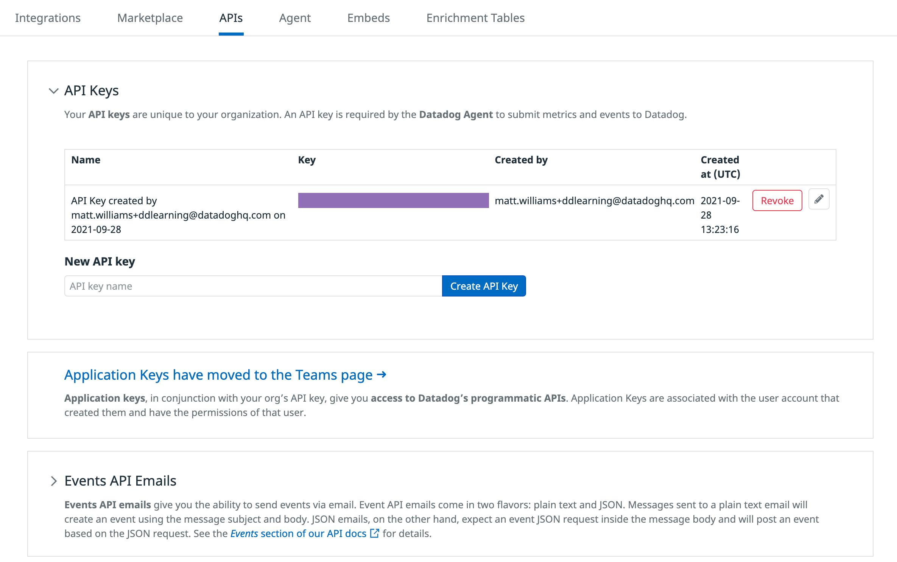

Welcome to the first section of the Introduction to Datadog course.

1. Take a look at the command listed below. See the little curled arrow icon that appears next to it? That means it's a clickable command. Just click it and the command will be copied to the terminal and executed.

    `ls -la`{{execute}}

1. In most of the sections of this course you will find the instructions for the course on the left with terminal and Visual Studio Code IDE tabs on the right. Whenever working in the IDE, your work will be saved automatically. Go ahead and select this tab now so the IDE is loaded and ready to go.

    You'll also find a tab titled "storedog", which you'll learn more about soon.

1. If you ever create a new file in the terminal, the IDE's file explorer should update within a few seconds. If it doesn't, click the refresh button above the file explorer and the view will update. The command below will create a new file called newfile.txt.

    `touch newfile.txt`{{execute}}

1. Now login to your <a href="https://app.datadoghq.com" target="_datadog">Datadog account</a>. In the terminal to your right, you should see login information for the account we created for you. Later if you forget the login information, run `creds`{{execute}} and you will see the information again.

1. Take a look around. We will be trying out many of the sections during this training.

1. Now verify that you are in the right organization. Visit <a href="https://app.datadoghq.com/account/settings#api" target="_datadog">the API Keys section</a>, which you can find in the Global Navigation under **Integrations > APIs**. Expand API Keys and hover over the purple rectangle to reveal the API key we have created for you.

    

1. In the Training Lab terminal, confirm that your API key is the same as the one saved as an environment variable with `echo $DD_API_KEY`{{execute}}. You don't have to memorize the entire key. Just making sure that the first and last couple of characters are the same should be good enough to ensure a match.  

    _Note: API and Application keys are different._

    If this is not the same API key that you saw in your Datadog account, you may have been in the wrong organization. You can switch organizations by clicking on the Account menu in the Datadog nav bar and selecting the new organization we created for you.

1. Now that you have verified that you are in the correct organization, move on to learn about the application you'll use to learn about the Datadog platform.
