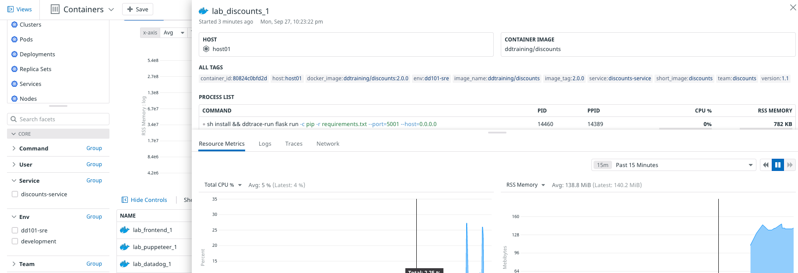
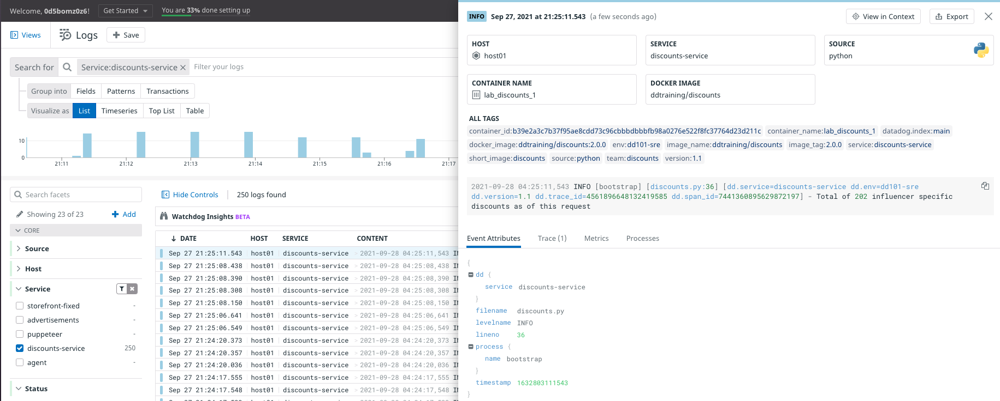

Next, you'll add metadata to the the discounts service so the Agent will know how to gather more detailed metrics and logs from it.

In the same way that you configured the Agent container, you'll add environment variables and labels to the `discounts` service in `docker-compose.yml`. These will work together to ensure traces and logs are collected from the service and sent to the Agent.

1. Open the file `docker-compose.yml`{{open}} in the IDE.

1. Add the the following environment variables to the `discounts` service by clicking on **Copy to Editor** in the following block of code:

    <pre class="file" data-filename="docker-compose.yml" data-target="insert" data-marker="# paste discounts vars here">
  - DD_ENV=dd101-dev
         - DD_SERVICE=discounts-service
         - DD_VERSION=1.1
         - DD_AGENT_HOST=datadog
         - DD_LOGS_INJECTION=true
         - DD_TRACE_ANALYTICS_ENABLED=true
         - DD_PROFILING_ENABLED=true
    </pre> 

1. The first 3 environment variables will tell the Agent to tag metrics, traces, and logs from this service with the `env:dd101-dev` and `service:discounts-service`, and `version:1.1`. Together, these comprise **Unified Service Tagging**, which allows you to seamlessly navigate Datadog to see data by service, environment, or version.

    The remaining variables tell the Agent to collect application traces, profiling metrics, and to associate APM and log entries with each other. You can learn more about container environment variables in [the docs](https://docs.datadoghq.com/agent/docker).

    These environment variables are passed down to their respective service, where the `dd-trace` library is installed and configured to tag outgoing data based on the values these variables store.

    > **Note:** It is important that you also install the `dd-trace` library into your service at the application level. Learn more about how to install the library in your service at the [Datadog documentation for APM.](https://docs.datadoghq.com/tracing/) 

1. Add the the following labels variables to the `discounts` service by clicking on **Copy to Editor** in the following block of code:

    <pre class="file" data-filename="docker-compose.yml" data-target="insert" data-marker="# paste discounts labels here">
labels:
         com.datadoghq.ad.logs: '[{"source": "python", "service": "discounts-service"}]'
         com.datadoghq.tags.env: 'dd101-dev'
         com.datadoghq.tags.service: 'discounts-service'
         com.datadoghq.tags.version: '1.1'
         my.custom.label.team: 'discounts'
    </pre> 

    The `com.datadoghq.ad.logs` label ensures that log entries are tagged with `source:python` and `service:discounts-service`. 

    The next 3 tags are the label counterparts to the Unified Service Tagging environmental variables you added previously. We recommended that you use both environment variables *and* labels.

    The last label sets the custom tag `team:discounts`, as declared in the `agent` service.

1. Run `docker-compose down && docker-compose up -d`{{execute}} in the terminal to restart the application stack.

1. Once the containers are running, run the Datadog status command: `docker-compose exec datadog agent status`{{execute}}. 

1. Scroll up to the **Logs Agent** section of the status output. Notice that there is one fewer container hash under **container_collect_all** and a new entry under **docker**. This is because the `discounts` container has been explicitly configured for logging, rather than implicitly captured by `container_collect_all`.

1. Scroll to the **APM Agent** section of the status output. You will see that **Receiver** now reports that there are APM traces "From python 3.9.6 ..." with some statistics. This is because the `discounts` service has been configured for APM with the `DD_TRACE_ANALYTICS_ENABLED` environment variable.

1. Navigate to **Infrastructure > Containers**. Click on **lab_discounts_1**. Notice the new `service`, `team` and `version` tags added under **ALL TAGS**.

    

1. Navigate to **APM > Services** and notice that **discounts** is now listed. **Note:** *Sometimes newly-configured APM data can take a long time to appear in the services view.*

1. Navigate to **Logs**, filter by the `discounts-service` facet, and click on a `discounts` log entry. You'll see that the log type is now **INFO**, that the **SOURCE** is now **python** (with a logo!), and under the **Event Attributes** tab the log entry is formatted as an interactive JSON object:

    

    You even see the process name, file name, and line number where the log line was emitted.

    Finally, notice that you now have data in the **Trace** tab. You'll learn more about traces in the APM lab.

Click the **Continue** button to configure the remaining services.