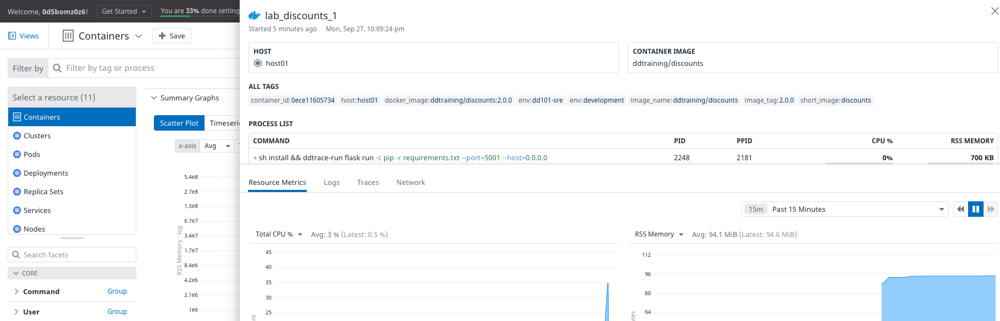
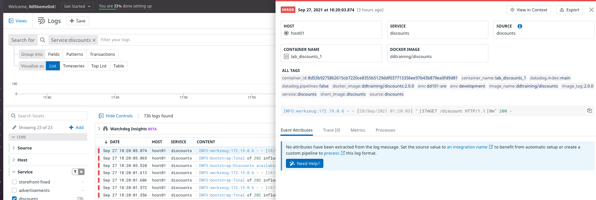

To understand how to install and configure the Agent in a containerized environment. You'll incrementally configure the Storedog services in Docker Compose, and see what becomes available in the Datadog App along the way.

1. Open the file `docker-compose.yml`{{open}} in the IDE.
1. Get familiar with the structure of this file. There is a block for each Storedog service: `discounts`, `frontend`, `advertisements`, and `db`.
    You can ignore `puppeteer`, which is synthesizing traffic to the application. 
1. Add the Datadog Agent as a service by clicking on **Copy to Editor** in the following block of code:
    <pre class="file" data-filename="docker-compose.yml" data-target="insert" data-marker="# paste agent block here">
   datadog:
       image: 'datadog/agent:7.31.0'
       environment:
         - DD_API_KEY
         - DD_LOGS_ENABLED=true
         - DD_LOGS_CONFIG_CONTAINER_COLLECT_ALL=true
         - DD_PROCESS_AGENT_ENABLED=true
         - DD_DOCKER_LABELS_AS_TAGS={"my.custom.label.team":"team"}
         - DD_TAGS='env:dd101-dev'
       ports:
         - '8126:8126'
       volumes:
         - /var/run/docker.sock:/var/run/docker.sock:ro
         - /proc/:/host/proc/:ro
         - /sys/fs/cgroup/:/host/sys/fs/cgroup:ro
       labels:
         com.datadoghq.ad.logs: '[{"source": "agent", "service": "agent"}]'
    </pre>
1. Notice the `DD_API_KEY` environment variable. This is set in the host environment, and you can see it by running `env |grep DD_API_KEY`{{execute}} in the terminal. Docker Compose will pass it along to the Agent container when it runs.
1. In the terminal, ensure you are in the `/root/lab` directory. If not, run `cd /root/lab`{{execute}} in the terminal.
1. Run `docker-compose up -d`{{execute}} in the terminal to restart the application stack.
1. Once the containers are running, run the Datadog status command: `docker-compose exec datadog agent status`{{execute}}. 
    This command tells `docker-compose` to execute the command `agent status` inside the `datadog` container.
1. Scroll to the **Logs Agent** section of the status output, and notice the **container_collect_all** block. Those hashes correspond to the container ids of all the services the Agent detected. 

    Even though you didn't configure the individual services for the Agent, the Agent's `DD_LOGS_CONFIG_CONTAINER_COLLECT_ALL=true` environment variable tells the Agent to grab all the logs of all the containers running along side it.
1. Scroll to the **APM Agent** section of the status output. You will see that its status is `running`, but the **Receiver** says "No traces received..." This is because no containers have been configured for APM yet.
1. To see the Agent's configuration, run `docker-compose exec datadog agent config`{{execute}}. In the `apm_config` section, you will see `enabled: true`. 

    APM is enabled by default for the Agent, but you could disable it by adding `DD_APM_ENABLED=false` to the `agent` block in `docker-compose.yml`.
1. In the Datadog App, navigate to [Infrastructure](https://app.datadoghq.com/infrastructure). You will see `host01`, which is the virtual machine hosting your lab environment. 

    The Agent container has access to the host that's running the Docker Daemon, which is running the Agent container!
1. Navigate to **Infrastructure > Containers**. Here you can see all of the service containers.
1. Click on `lab_discounts_1` and notice the metadata the Agent captures by default.

    

1. Navigate to **APM > Services** and notice that nothing is detected. This is because no services are configured for APM yet.
1. Navigate to **Logs**. You'll see a lot of log entries here. In the facets panel on the left, select **discounts** to show logs from that service only. 

    You are able to see logs from the `discounts` service because the Agent is configured to capture logs from all containers. But notice that they are all deemed **ERROR**, as indicated by the red marks. 

1. Click on a `discounts` log line. In addition to the log line content, the Agent was able to capture a lot of metadata, such as the **CONTAINER NAME**, **DOCKER IMAGE**, and **SERVICE** and **SOURCE** based on the service name.

    Notice the tip at the bottom of the log details panel, recommending that you should set the source to an integration name.

    

    You'll see how to do this in the next step, and get even better log details.

Click the **Continue** button to configure the discounts service for the Agent container.