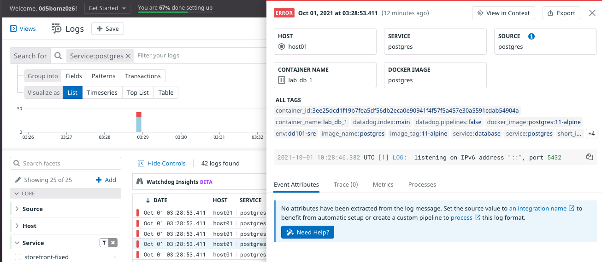
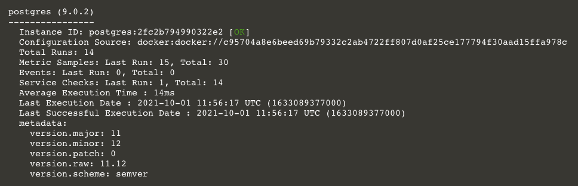

Storedog is running in Docker and the Agent is collecting data from the services running in containers. Currently, the Agent doesn't know what type of services they are. 

For example, the `db` container is running PostgreSQL. The Agent can see what processes are running in the container, e.g. `postgres: stats collector`, but it needs some help identifying this as a known, "core" integration. 

The logs from the database service are messy, too. The Agent collects them as-is, without any special processing. 

Consequently, many are incorrectly tagged as errors. Furthermore, the `service` in log lines is identified as `postgres`, even though it is tagged as `database` in the docker-compose.yml file:

There's a helpful note at the bottom of this log line detail. 

> No attributes have been extracted from the log message. Set the source value to an integration name to benefit from automatic setup...

Navigate to the **Integrations** page. Under **Installed**, you should see **Docker**, with an indicator that it's installed. This is one of integrations that Datadog can Autodiscover. The Agent recognizes it as soon as it mounts the `docker.sock` file from the host, which you configured in the Agent lab earlier.

PostgreSQL needs a bit more work. In the search field at the top of the Integrations page, type `postgres`. Click on the card, and then on the **Configuration** tab.

Under **Prepare Postgres**, there are `psql` commands to create a user for the Agent to read statistics. This was already done for you when the lab started.

Scroll down to the **Docker** section and look at the instructions for enabling metric, log, and trace collection. 

### Configure the Postgres Integration

Following the instructions from the Postgres Integration:

1. Open `docker-compose.yml`{{open}} in the IDE and find the `db` service section

2.  The following lines have been adapted for docker-compose.yml. Add them to the `labels` block.
    <pre class="file" data-filename="docker-compose.yml" data-target="insert" data-marker="# postgres integration template here">
    com.datadoghq.ad.check_names: '["postgres"]'
          com.datadoghq.ad.init_configs: '[{}]'
          com.datadoghq.ad.instances: '[{"host":"%%host%%", "port":5432,"username":"datadog","password":"datadog"}]'</pre>

    This is an Autodiscovery Integration Template that tells the Agent that this is a known service, and provides the details of how to connect to it.

3. Add this line and add it to the same `labels` section:
    <pre class="file" data-filename="docker-compose.yml" data-target="insert" data-marker="# postgres logs label here">
   com.datadoghq.ad.logs: '[{"source": "postgresql", "service": "database"}]'</pre>

    This configures the log integration for PostgreSQL.

4. Finally, you need to add an environment variable to the `agent` service. Copy the following line and add it to the `environments` block:
    <pre class="file" data-filename="docker-compose.yml" data-target="insert" data-marker="# agent non-local apm here">
   - DD_APM_NON_LOCAL_TRAFFIC=true</pre>

     This configures the Agent to observe other containers' performance at the application level.

### See the Results
1. In the terminal, run `docker-compose down && docker-compose up -d`{{execute}} to restart the stack

1. After docker-compose finishes restarting, check the Datadog Agent status  with the command `docker-compose exec datadog agent status`{{execute}}

2. Scroll up to the **Running Checks** section and find the new **postgres** section:

    

    If you don't see it on the first run, the Agent was still starting up. Rerun the command and you should see it.

3. Return to the **Integrations** page in Datadog. You should see that the Postgres Integration is now installed. Click the card again, and open the **Metrics** tab.  These are the new metrics available thanks to this integration.

4. Navigate to **Metrics > Explorer**. In the **Graph** field, type `postgres.table.count` and hit the Enter key. You should see a steady graph of 4 tables over time.

5. Navigate to **Dashboards** and find **Postgres - Overview** and **Postgres - Metrics**. These are pre-made Dashboards provided by the integration. Open them up to see what they provide.

6. Navigate to **Logs** and click the `database` facet on the left-hand side to filter the log lines for that service. Notice that there are far fewer errors, because Datadog can now parse PostgreSQL log lines more intelligently. 

7. Click on a non-error log line and look at the detail panel. You can see that it's correctly identified as the `database` service, and that the **Event Attributes** are formatted as JSON. This is a benefit of the logs pipeline that came with this integration.

    

8. Navigate to **Logs > Configuration** and click on the new **Postgresql** pipeline to see how logs are processed.

Click the **Continue** button. 