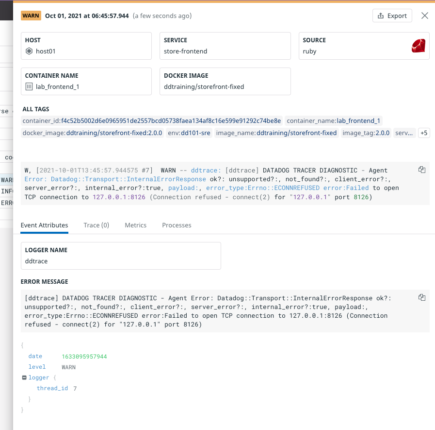

The other Storedog services run either Ruby or Python, both of which have core integrations. Datadog just needs to know whether their `source` is `ruby` or `python`. This is achieved with a single label for each service.

Start by adding an autodiscovery label for the discounts service:

1. Open `docker-compose.yml`{{open}} in the IDE

2. Add this line to the `discounts` service labels:

    <pre class="file" data-filename="docker-compose.yml" data-target="insert" data-marker="# discounts log label here">
   com.datadoghq.ad.logs: '[{"source": "python", "service": "discounts-service"}]'</pre>

    The only difference from the PostgreSQL counterpart is the `source` value.

3. Add this to label the `advertisements` service:
    
    <pre class="file" data-filename="docker-compose.yml" data-target="insert" data-marker="# advertisements log label here">
   com.datadoghq.ad.logs: '[{"source": "python", "service": "advertisements-service"}]'</pre>

4. Add this to the `frontend` service:
    <pre class="file" data-filename="docker-compose.yml" data-target="insert" data-marker="# frontend log label here">
   com.datadoghq.ad.logs: '[{"source": "ruby", "service": "store-frontend"}]'</pre>
    
    Note that the `service` value is the same as each services `com.datadoghq.tags.service` label value.

5. In the terminal, restart the stack one more time with `docker-compose down && docker-compose up -d`{{execute}}

6. Run `docker-compose exec datadog agent status`{{execute}}

    Scroll up to the **Logs Agent** section, and noticed that each container you added the `com.datadoghq.ad.logs` label to has its own entry displaying its status and statistics. They had been grouped under **container_collect_all** with aggregated statistics

    

7. In the Datadog App, look at the **Integrations** page to see the newly-installed integrations

8. Look at the new log lines and click on them to observe the details. Pay special attention to the new store-frontend log lines:

    

    These are especially nice. Notice under **Event Attributes** that there is a **LOGGER NAME** of `ddtrace`. This is because the store-frontend had been instrumented with Datadog's tracing client for Ruby. You'll learn more about that in the APM Lab.

When you are done with this section, run the `finish`{{execute}} command.

Click the **Continue** button to wrap up this lab.