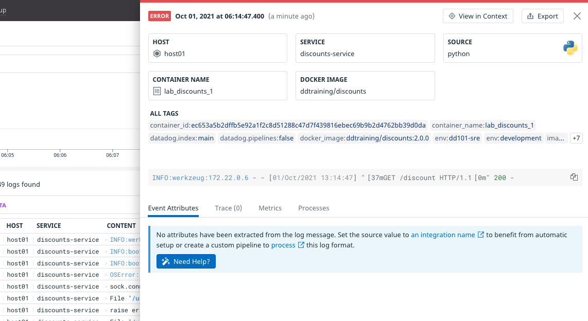

The other Storedog services run either Ruby or Python, both of which have core integrations. Datadog just needs to know whether their `source` is `ruby` or `python`. This is achieved with a single label for each service.

Start by adding an autodiscovery label for the discounts service:

1. Open `docker-compose.yaml`{{open}} in the IDE

2. Add this line to the `discounts` service labels:

    <pre class="file" data-filename="docker-compose.yml" data-target="insert" data-marker="# discounts log label here">
   com.datadoghq.ad.logs: '[{"source": "python", "service": "discounts-service"}]'</pre>

    The only difference from the PostgreSQL counterpart is the `source` value.

3. Restart the stack in the terminal with `docker-compose down && docker-compose up -d`{{execute}}

4. In the Datadog App, navigate to **Logs** and wait for new log lines to appear.

5. Click on one to view the details:

    

6. You can see that the source was correctly identified by Datadog by the Python logo in the upper-right corner, but the logs are not getting parsed. Looking at **Logs > Configuration**, you'll see that the pipeline is indeed active. 

    The problem is that the discounts service doesn't log in a standard format. It's up to the application developer to emit logs that are easily parsed by Datadog. There are ways around this that you'll learn about in the Logs and APM labs. The [Python integration documentation](https://docs.datadoghq.com/logs/log_collection/python/?tab=jsonlogformatter) also provides a solution. 

Now you can add autodiscovery labels to the other services.

1. Add this to lable the `advertisements` service:
    <pre class="file" data-filename="docker-compose.yml" data-target="insert" data-marker="# advertisements log label here">
   com.datadoghq.ad.logs: '[{"source": "python", "service": "advertisements-service"}]'</pre>

2. Add this to the `frontend` service:
    <pre class="file" data-filename="docker-compose.yml" data-target="insert" data-marker="# frontend log label here">
   com.datadoghq.ad.logs: '[{"source": "ruby", "service": "store-frontend"}]'</pre>
    
    Note that the `service` value is the same as each services `com.datadoghq.tags.service` label value.

3. In the terminal, restart the stack one more time with `docker-compose down && docker-compose up -d`{{execute}}

4. Run `docker-compose exec datadog agent status`{{execute}}

    Scroll up to the **Logs Agent** section, and noticed that each container you added the `com.datadoghq.ad.logs` label to has its own entry displaying its status and statistics. They had been grouped under **container_collect_all** with aggregated statistics

    

5. In the Datadog App, look at the **Integrations** page to see the newly-installed integrations

6. Look at the new log lines and click on them to observe the details. Pay special attention to the new store-frontend log lines:

    

    These are especially nice. Notice under **Event Attributes** that there is a **LOGGER NAME** of `ddtrace`. This is because the store-frontend had been instrumented with Datadog's tracing client for Ruby. You'll learn more about that in the APM Lab.

When you are done with this section, run the `finish`{{execute}} command.

Click the **Continue** button to wrap up this lab.