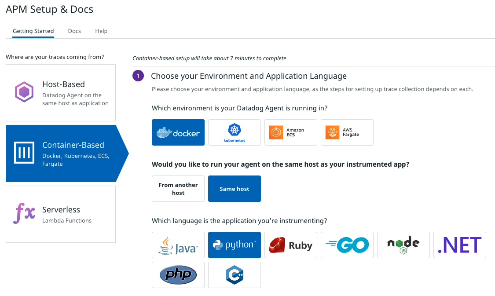
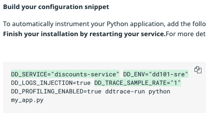
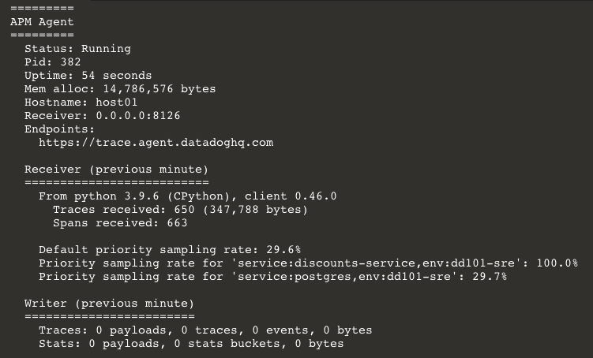

### About Tracing
Application traces are continuous streams of data about an application's execution. They can tell you the specific lines of code that ran, when they ran, and how long they took. 

When configured correctly, Datadog associates traces with everything it knows about your infrastructure. You can fluidly navigate across traces, logs, processes, metrics and events to get a complete picture of what was happening at any point in time.

The Datadog Agent is automatically configured to accept traces. You need to instrument your applications to submit them to the Agent. This is done by adding a Datadog tracing library to your application. 

### Trace the Discounts Service

The Datadog Application can walk you through enabling tracing for many languages in several environments:

You'll start by instrumenting the discounts service, which is written in Python:

1. In the Datadog App, navigate to the [APM Setup & Docs](https://app.datadoghq.com/apm/docs) page.

2. Click on **Container-Based**, then **Docker**, then **Same host**, then **Python**

    Under **Run the Agent**, your are told to open port `8126` to the local or remote services you want to trace. 

3. In the IDE, open `docker-compose.yml`{{open}}

4. Click this code to add the `ports` section to the `datadog` service:

    <pre class="file" data-filename="docker-compose.yml" data-target="insert" data-marker="# agent tracing port">ports:
         - 127.0.0.1:8126:8126/tcp</pre>

5. Back in the Datadog App, Step 3 tells you to add the `ddtrace` library to a Python application. 

    In the IDE, open `discounts-service/requirements.txt`{{open}} These are the libraries that will be installed when the discounts service starts up.
    
    On line 4, you can see that `ddtrace==0.46.0` is already listed. Thanks to Storedog's forward-thinking developers, you don't need to do anything further with the application code.

6. Step 4 helps you build the command for running a Python script with `ddtrace-run`. `ddtrace` relies on environment variables to know where and how to send traces to the Datadog Agent.

    In the form, set **DD_SERVICE** to `discounts-service`

7. Set **DD_ENV** to `dd101-dev`

8. Enable **Tracing Without Limits**. 

9. Enable **Continuous Profiler**

10. Your configuration snippet should look like this:

    

    This is all the information you need, but it will be formatted differently in the `docker-compose.yml` file.

11. In the IDE, open `docker-compose.yml`{{open}}

12. Click on these lines to insert the environment variables:

    <pre class="file" data-filename="docker-compose.yml" data-target="insert" data-marker="# discounts tracing vars">- DD_SERVICE=discounts-service
          - DD_ENV=dd101-dev
          - DD_LOGS_INJECTION=true
          - DD_TRACE_SAMPLE_RATE=1
          - DD_PROFILING_ENABLED=true
	      - DD_AGENT_HOST=datadog </pre>

    Note the addition of `DD_AGENT_HOST`, which tells `ddtrace` to send traces to the `datadog` service.

13. Finally, in the `discounts` service `command` section, add `ddtrace-run`. The complete command should be:

    `ddtrace-run flask run --port=5001 --host=0.0.0.0`

14. In the terminal, restart the application with `docker-compose down && docker-compose up -d`{{execute}}

14. Confirm that the discounts service application is sending traces to APM by running `docker-compose exec datadog agent status`{{execute}}

    Scroll to the **APM** section. It is now receiving Python traces from the discounts service:

    

Click the **Continue** button to see what is now available in the Datadog App.