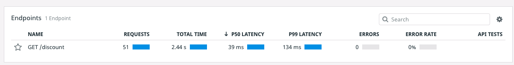
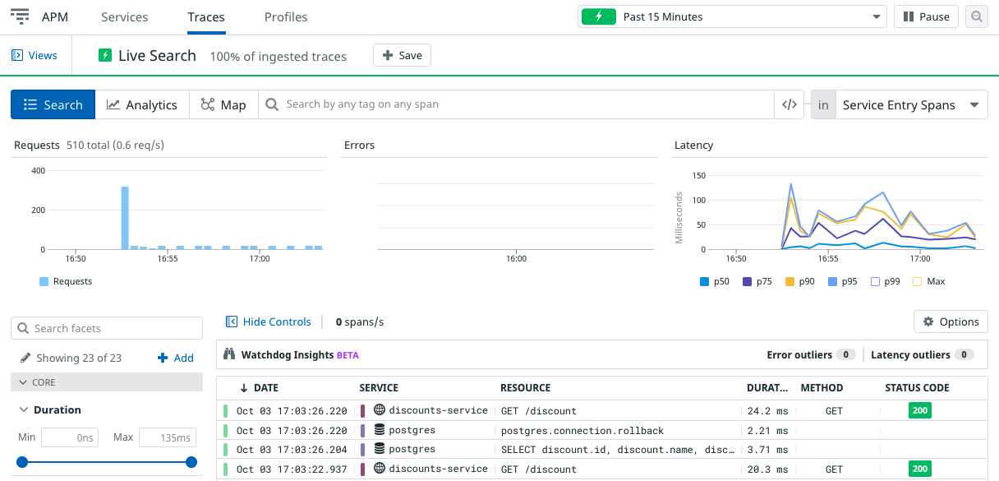
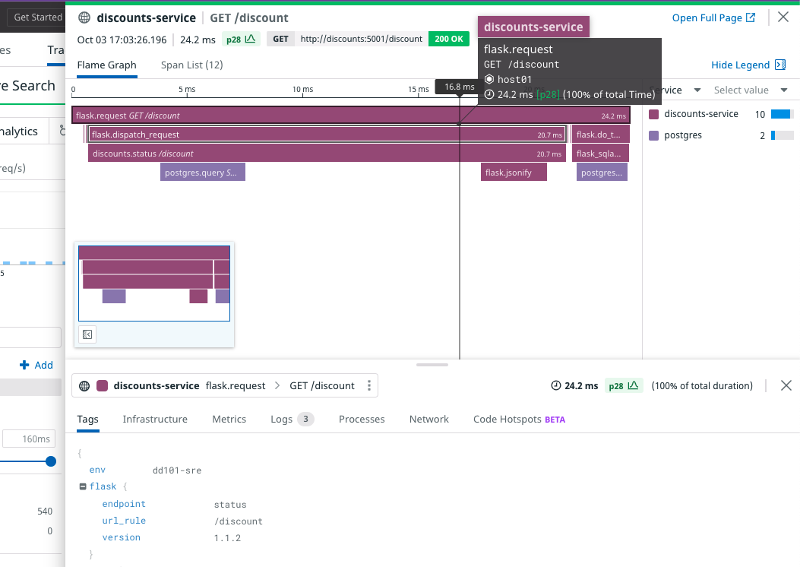
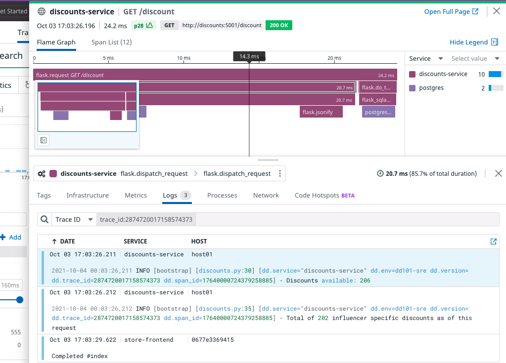
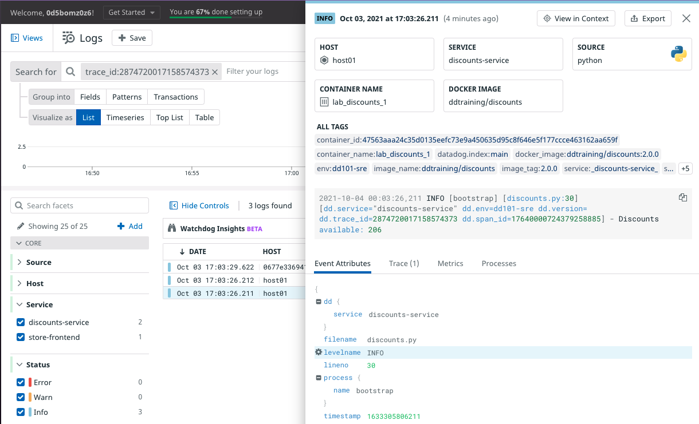
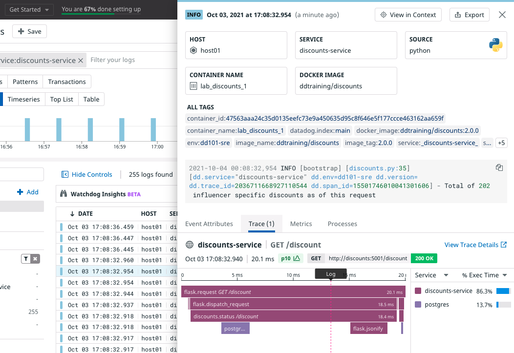

With the Agent collecting traces from all of the Storedog services, you can take a look at those traces in the Datadog App.

1. Navigate to <a href="https://app.datadoghq.com/apm/services?env=dd101-dev" target="_datadog">**APM > Services**</a>. You'll see the a list of all the services that are enabled. You'll also see `postgres`, which doesn't communicate with the Datadog Agent directly.

    `postgres` shows up because `discounts-service` traces capture it. You configured the PostgreSQL integration in the previous lab, but it doesn't send traces to the Datadog Agent. Applications that *connect* to the database do.

1. You'll notice the `discounts-service` has an alert in the **Monitors** column on the page. A site reliability engineer (SRE) at Storedog created a monitor to check the latency of this service, and it seems to be a bit higher than expected.

    You'll come back to this in a few minutes, but for now, continue exploring APM.

1. Select the <a href="https://app.datadoghq.com/apm/map?env=dd101-dev" target="_datadog">**APM > Service Map**</a> tab and you'll see a map of how each service communicates with one another.

1. Click on **discounts-service** and then **View service overview**

    On the resulting page, scroll down to **Endpoints**. Here you will see all of the service's application endpoints that APM traced. This service has one endpoint, `GET /discount`

    

1. Navigate to <a href="https://app.datadoghq.com/apm/traces?query=env%3Add101-dev" target="_datadog"> **APM > Traces**</a>. Here you see a live stream of the traces APM has captured over the past 15 minutes. 

    

    Scroll down and click on an older `discounts-service` trace. This flamegraph displays the time spent in each service for this trace. 

    

1. Click the **Logs** tab at the bottom of the trace details panel. These are the related log lines captured during the trace's timeframe.

    

    Mouse over each line and look at the flamegraph. You'll see a vertical line marking the exact point in the trace that the log line was emitted. This is enabled by the `DD_LOGS_INJECTION` configuration.

1. Click on a log line from `discounts.py`. This takes you to a detailed view in the line in the Logs Explorer.

    

1. Close the log detail and notice that the search field is filtering logs by the specific ID of the trace. 

    Clear the search field and change the timeframe to `Past 15 Minutes` to view all logs.

    Click on the `discounts-service` facet on the left to see only those from the `discounts-service`

1. Click on a `discounts-service` log line for `discounts.py`.

    Click on the **Trace** tab.

    

    Here is the trace for this log line right in the log details view!

1. Click on **View Trace Details** to view the trace in the APM trace details page. 

You can now travel back and forth between between APM traces and logs for the discounts service.  

Click the **Continue** button move onto the next step, where you'll address the monitor from earlier.
