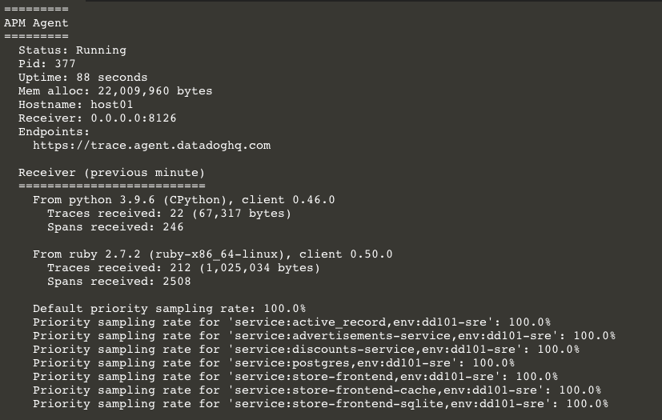
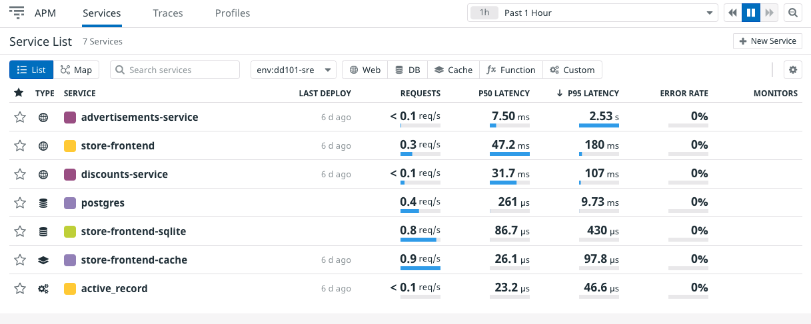
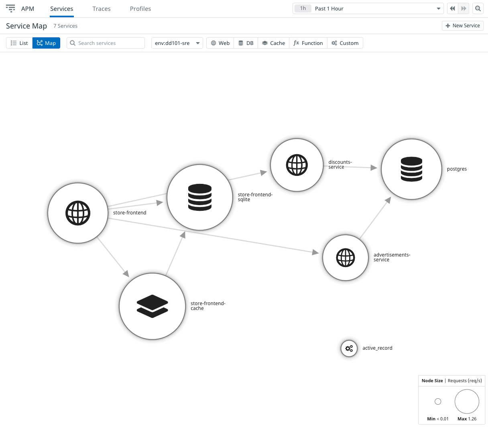

The other Storedog services to trace are the advertisements service, which is another Python Flask application, and the store frontend, which is a Ruby Spree application. 

You can enable the advertisements service exactly as you did the discounts service.

Datadog maintains a `ddtrace` client for Ruby, which the store frontend application already uses. There is no equivalent to the Python client's `ddtrace-run` in the Ruby client, so you don't need to change the command in `docker-compose.yml`. You only need to add the environment variables.

For your comfort, there is a docker-compose.yml file that is already updated.

In the terminal, run `cp /root/docker-compose-complete.yml /root/lab/docker-compose.yml`{{execute}} to use it.

Click on the IDE tab to look at the newly added environment variables for the `advertisements` and `frontend` services.

In the terminal, restart the application stack one more time with the command `docker-compose down && docker-compose up -d`{{execute}}.

Run `docker-compose exec datadog agent status` and look at the **APM Agent** check. 

Notice that in addition to the services configured in `docker-compose.yml`, two new services are emitting traces: `store-frontend-cache` and `store-frontend-sqlite`. These are running in the `frontend` container, and APM is able to collect their traces as well.

Navigate to **APM > Services** in the Datadog app, and explore the traces for the entire application. It may take a couple minutes for them all to roll in.

Finally, navigate to **APM > Service Map** to see a visualization of the services communicating with each other. 

You can hover over each service in the map to see an animated indication of services that are communicating with each other directly.

Storedog is now fully instrumented for the purposes of this workshop.

Click the **Continue** button to take a quick look at Continuous Profiling.