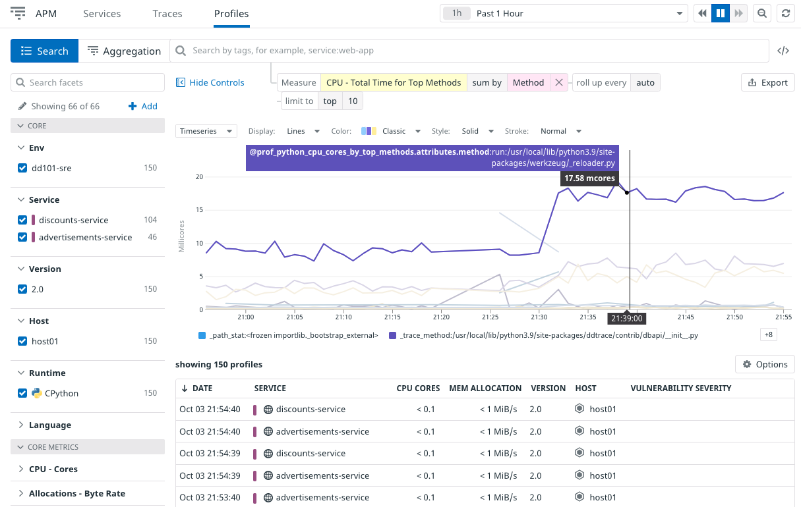
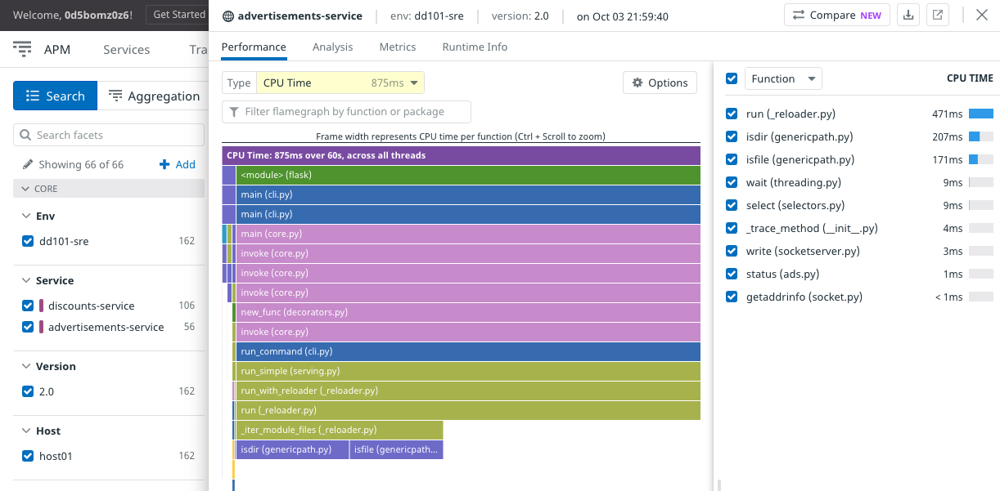

Datadog's Continuous Profiler gives you insight into system resource consumption of your applications beyond traces. You can see CPU time, memory allocation, file IO, garbage collection, network throughput, and more.

Profiling is enabled for Storedog's Python services. Profiling for Ruby is currently in beta, and the frontend service is not yet instrumented for it. 

Navigate to **APM > Profile Search** to see the profiling for `advertisements-service` and `discounts-service`.

At the top is a graph of `CPU - Total Time for Top Methods`. Change **sum by** to `Service` to compare the two services.

Click on a profile from the list below the graph.

Mouse over the spans in the flame graph to see more information. 

In the dropdown to the right, change **Function** to **Package**

When you are done with this section, run the `finish`{{execute}} command.

Click the **Continue** button to wrap up this lab.

