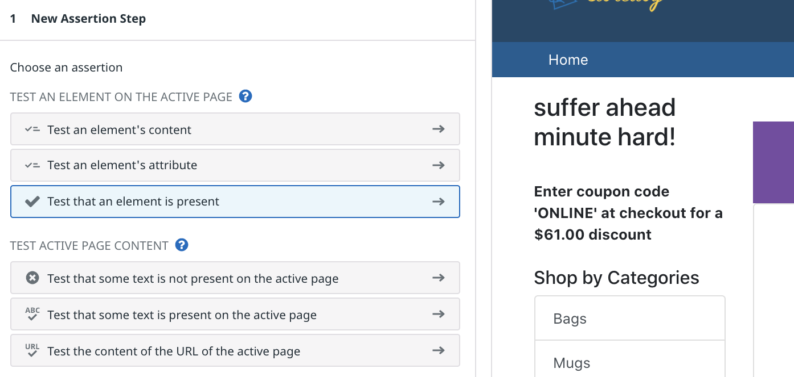
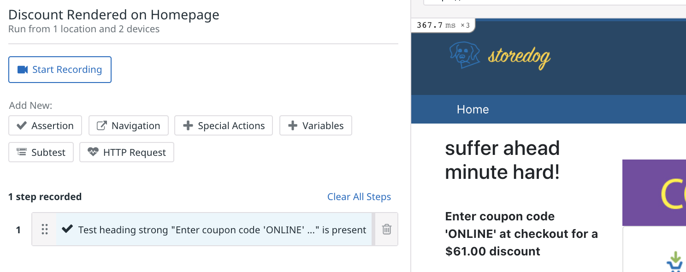
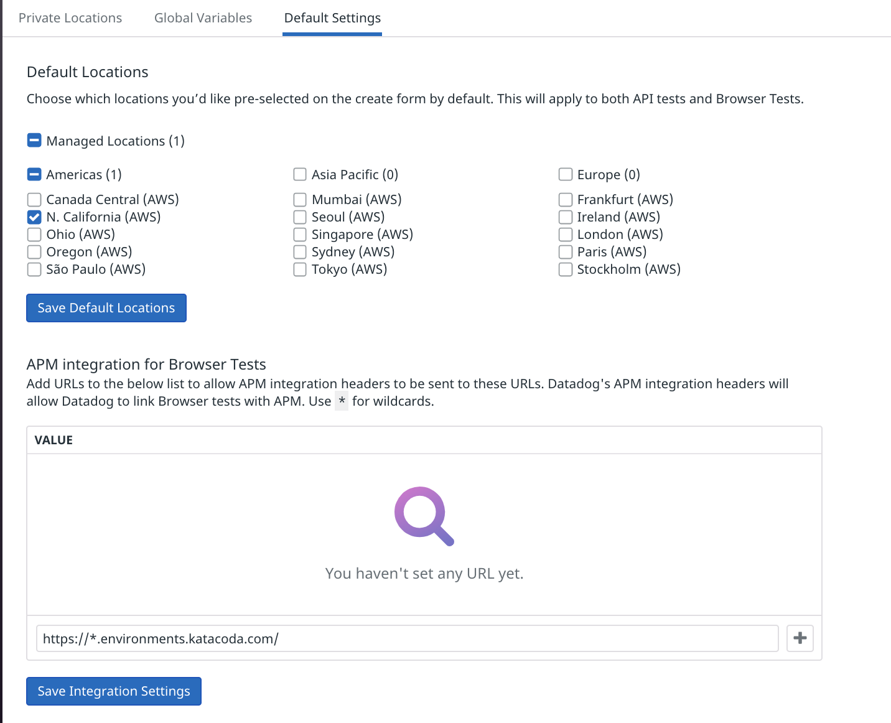
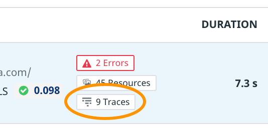

You now have API tests to monitor the availability, performance, and functionality of the Storedog discounts service. Now you'll employ a browser to monitor Storedog's frontend to ensure a good user experience. 

Earlier in this lab you saw how the Storedog frontend displays the response from the discounts service in the upper-left corner of the home page as a "coupon block":

API tests make assertions about the raw content of HTTP responses, and browser tests make powerful assertions about a web page's Document Object Model (DOM) as rendered by a browser.  For example, "This specific element is in the upper-left corner of the homepage," or "This heading is not empty and is displayed with the Helvetica font at 20 pixels." You can also record user actions to change the state of the page, such as clicking on buttons, hovering, and navigating to new pages.

The business requirements for the coupon block are:
1. It's displayed on the home page
2. It displays a heading
3. It contains a valid coupon code 

By the way, you may have noticed that the domain language for the discounts service is getting a little hazy. The Storedog frontend folks refer to discounts as "coupon codes," because that's how discounts are modeled for customers. So keep in mind that "discount code" and "coupon code" are synonymous, as well as "discount value" and "coupon value", and "discount name" and "coupon heading." 

**Note:** *To create and edit browser tests, you must use Google Chrome and be able to install an extension from the Chrome Web Store. You may return to your preferred browser after you have created browser tests. The Datadog App will prompt you to install the extension.*

Now you can turn these frontend business requirements into a browser test.

## Create a Simple Browser Test
Before you proceed, create a new Global Variable for your lab's Storedog frontend URL. Follow the procedure you used to create `DISCOUNT_URL` in the previous step. Name the new Global Variable `FRONTEND_URL`, and give it the value `https://[[HOST_SUBDOMAIN]]-3000-[[KATACODA_HOST]].environments.katacoda.com/`{{copy}}.

In the Datadog App, navigate to **UX Monitoring > New Test** and click on **New Browser Test**. Browser tests are configured in two parts. First, you configure the details common to synthetic tests. Then, you will record the specific actions the test should perform on the web application to satisfy assertions.

### Test Details
1. For **Starting URL**, enter the global variable `{{ FRONTEND_URL }}`.
1. For **Name**, enter something like "Discount Rendered on Homepage".
1. Under **Browsers & Devices**, leave the defaults. These parameters are unique to browser tests and you should tailor them to suit your web application's typical visitor. Note that each selection will result in a separate test result.
1. Under **Locations**, choose one or more regions from which to run the test. 
1. Under **Specify test frequency**, select **1w**. You will also trigger this test on demand in this lab.
1. You can leave the defaults for **Define alert conditions** and **Notify your team**, as the notifications are the same as those from API tests.
1. Click **Save Details & Record Test** to move to the next step.

### Install the Test Recorder Extension
If you have already installed the Datadog Test Recorder extension, skip down to Edit the Browser Test. If not, you will see "Add our Chrome extension" and a **Add the Extension** button. 
1. Click the **Add the Extension** button to open the Chrome Web Store. 
1. On the **Datadog test recorder** page, click the **Add to Chrome** button.
1. Chrome will prompt you to confirm the installation. Click **Add extension**
1. You will see a dialog pop-up at the top of Chrome confirming that the extension is installed. It will say "Use this extension by clicking on this icon," but that is not necessary; the Datadog App will activate it when necessary.
1. Click Chrome's **Back** button to return to the Edit Browser Test page.

### Edit the Browser Test
If you have installed the Datadog Test Recorder extension, it will automatically make a request to the **Starting URL** you provided and display the results in the right-hand pane. You should see the Storedog homepage there now. You will now record a test to cover business requirement #1: the coupon code block is displayed on the home page.

There is a tantalizing **Start Recording** button at the top of the left-hand pane. This is useful if the assertions you will make require user interaction to alter the page state, such as typing into a form or navigating to another page. In this lab, we will only make assertions based on the state of the homepage when it first loads without any user interaction.

1. Under **Add New**, click **Assertion**.
1. Click **Test that an element is present**. 
    
1. Hover over the coupon block content, under the heading. It is the text that begins, "Enter the coupon code..." You will see a dashed outline surrounding the DOM element that Datadog detects. Move your cursor around to see what other elements Datadog detects.
1. Click on the coupon block content. You will see a new assertion appear on the left:
    
1. Click on the new assertion. Note that you can update **Step Name** and configure **Advanced Options**. 
1. Change **Step Name** to `Coupon Block Content Present`{{copy}}, and then click **Apply**.
1. This is a good start. Click **Save & Launch Test** which will automatically launch the test for you.

After a few seconds you should have test results to observe:

1. Scroll down to the **Test Results** section and click the **Refresh** button to see the results. You should see a result for every browser and device you configured. Click on one to view the test result details.
1. Click on the first result. You will see a line for each step in your browser test, with Step 0 always being "Navigate to start URL":
    
Each step will have a screenshot of what Datadog saw when it executed the step, a summary of the step details, performance metrics, indicators for browser errors detected and resources downloaded, associated backend traces, and a waterfall graph segment indicating how long the step took to be executed.
1. Click on the **2 Error** indicator in Step 0. This will display a panel similar to a web browser's developer tools:
    
Here you will see any errors, warnings, or messages that a web application logs to a browser's console. In Step 0, you can see the Console error, "Client Token is not configured, we will not send any data," and possibly others. You can ignore these.
1. Click on the **Resources** tab, or close the panel and click on the **Resources** indicator in the Step 0 results. This displays all of the resources that the browser downloaded to render the page:
    
Here you can search resources, or filter them by toggling the types to the right of the search field.
1. Click on the **Traces** tab to see the Application Performance Monitoring (APM) traces collected during this step. You will see "No traces associated with this step." Contrarily to HTTP tests, Datadog does not automatically associate APM traces with browser test results. You must specify the URLs for which Datadog should add the [necessary headers](https://docs.datadoghq.com/synthetics/apm/#how-are-traces-linked-to-tests):
    1. Navigate to **UX Monitoring > Settings** and click on the **Default Settings** tab.
    1. Under **APM integration for Browser Tests**, add the following wildcard URL for Storedog running in your lab environment. The exact URL will change if your session expires, if you refresh your browser, or when you start the second part of this course. This wildcard should continue to work in all cases:

        `https://*.environments.katacoda.com/*`{{ copy }}

        
    1. While you're here, note that you can also set **Default Locations** for future API and browser tests.
    1. Return to the browser test page and click **Run Test Now** to get results including APM traces.
    
    When APM traces for browser tests are configured, you will see a **Traces** indicator in the first **Step Results** row. If you don't see traces in Firefox results, try Chrome results instead.

    
    
    Clicking the **Traces** indicator will display a flame graph for all APM-enabled services that did some work in this step of the browser test:
    

    You can click the **View Trace in APM** link to dig deeper into the traces. See the Datadog Documentation to learn more about [APM traces in synthetic tests](https://docs.datadoghq.com/synthetics/apm).

Now that you have a basic browser test covering the first business requirement for the coupon block, you can add more steps to cover the remaining requirements.

Click the **Continue** button to complete the browser test.
