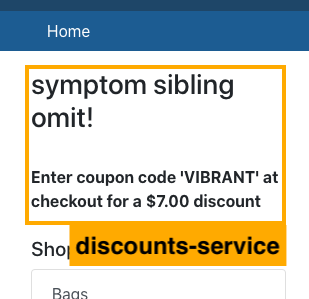
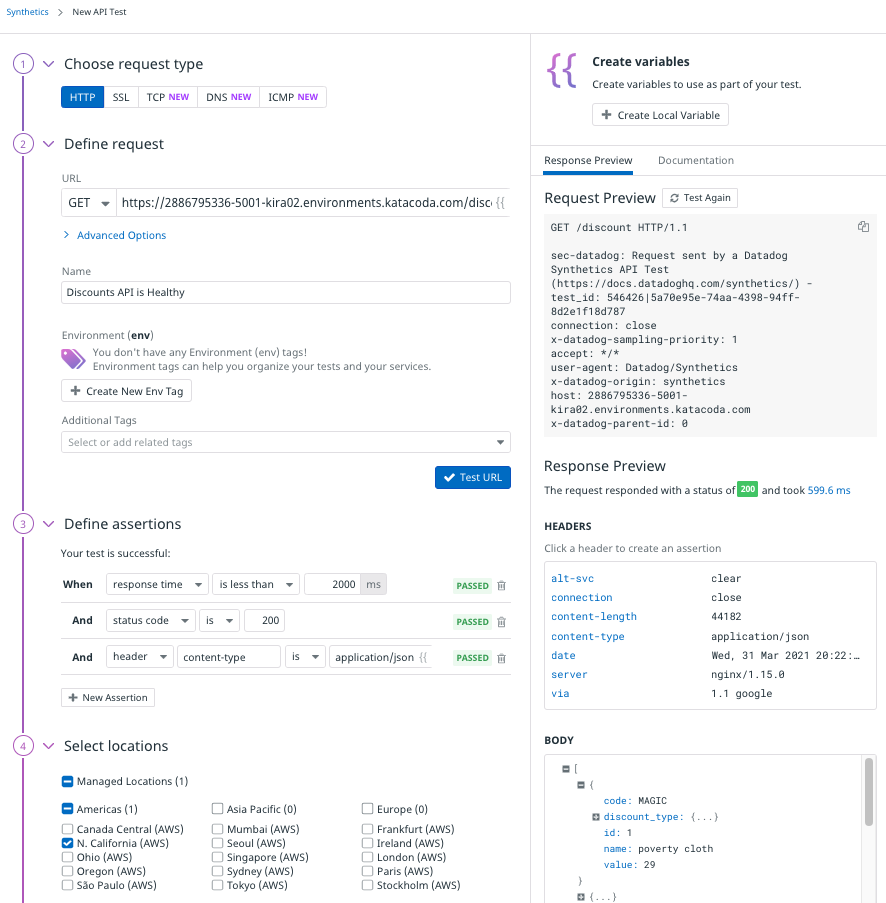
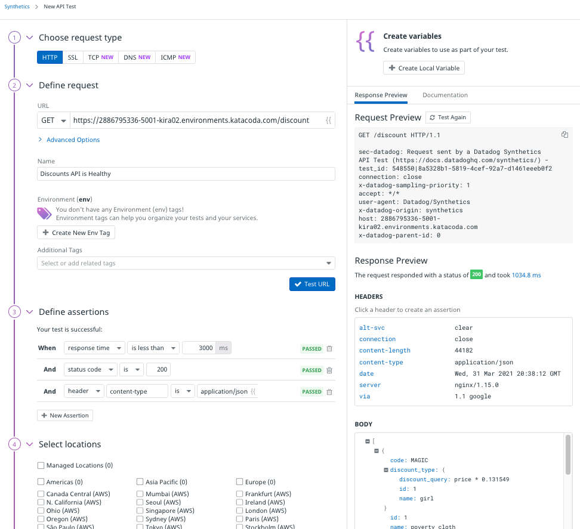
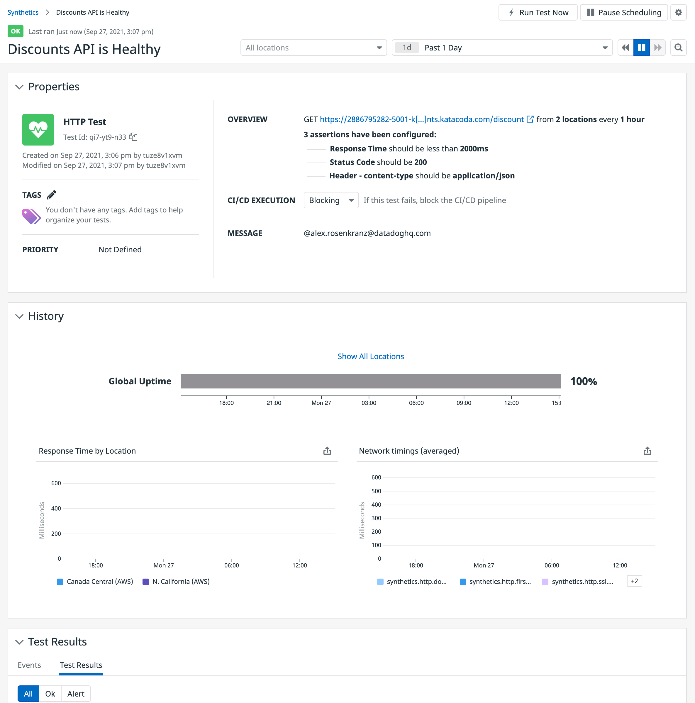
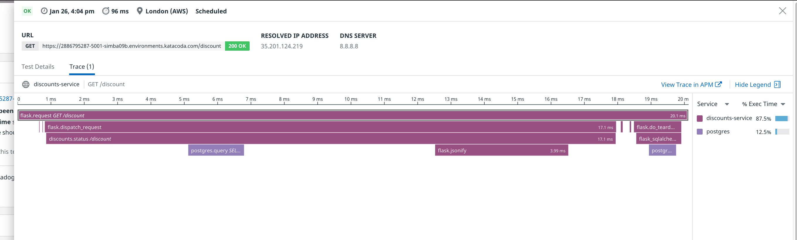

In this step, you're going to create an API test to ensure that the discounts service continues to function properly in production. You'll start with a simple test to ensure that the service returns a response, and then improve the test to ensure that the service returns a *valid* response.

## About the Discounts Service

First, run `curl http://localhost:5001/discount`{{execute}} or click on the **Discounts API** tab to the right to get a quick understanding of what this API responds with. It should look something like this:

```json
  {
    "code": "VIBRANT", 
    "discount_type": {
      "discount_query": "price * 0.660373", 
      "id": 2, 
      "name": "hello"
    }, 
    "id": 2, 
    "name": "symptom sibling omit", 
    "value": 7
  }
```

The store-frontend service picks a random discount from the response and creates a coupon section in the upper-left corner of the Storedog homepage. 



Now that you know what a healthy discounts-service should serve, you can create an API test to monitor its health.

## Create a Basic API Test

1. Navigate to <a href="https://app.datadoghq.com/synthetics/tests" target="_blank">**UX Monitoring > Synthetic Tests**</a> in the global navigation. You will see the Get started with Datadog Synthetics introduction page. 

2. Click the **Get Started** button and then the **New API Test** button in the resulting modal dialog.

3. In the **Define request** section, enter your discount service URL, which is `https://[[HOST_SUBDOMAIN]]-5001-[[KATACODA_HOST]].environments.katacoda.com/discount`{{copy}} 

4. You can keep the auto-generated **Name**, or replace it with something like "Discounts API is Healthy."

5. Click the **Test URL** button to ensure that the URL is correct and yields the expected response, which can be seen on the right-hand side of the screen.

  > **Note:** If you do not see the **Response Preview** tab, widen your browser window.

6. Under **BODY**, you should see the JSON document containing the discount codes. Click the **+** beside a collapsed JSON object to expand it and see its values. Your New API Test page should look something like this:

  

7. When Datadog tested the discounts URL, it created three baseline assertions based on the response:

  * The response time is under 2 seconds.
  
  * The HTTP status code is 200 OK.
  
  * The content-type header is application/json. 
  
  It is likely that these assertions passed on your test run, indicated by green **PASSED** labels. 
  
  If they didn't (red **FAILED** labels), make sure that **URL** is correct, and that the discounts service is still running correctly in the lab.

8. Choose one or more **Locations** from which to run the test.

9. Next, set **Specify test frequency** to **1hr**. You will also be running the test on-demand in this lab. 

10. Leave the default values under **Define alert conditions**, which will ensure an immediate alert on the first test failure.

11. Under **Notify your team**, pick an email address you would like to use to receive alerts, and reference it in the text area.

12. Click **Create Test** to see your new test in the Synthetics Test Details page. The test will automatically run the first time when you click the button, and the results will appear in the **Test Results** section at the bottom of the page. 

  You should see a green **OK** within a couple minutes corresponding to each location from which the test was run:

  

## Examine the Test Results

1. Click one of the results under **Test Results**. 

2. A panel will slide out displaying the details of the test result. 

  Up top, you see the date and time that the test was run, the duration of the test, the location from which it was run, the DNS server used and the IP address it resolved for the test URL. Below that are two tabs, **Test Details** and **Trace**.

3. **Test Details** features a waterfall graph illustrating the time consumed by each step of the test request, from DNS resolution to Download. 

  Below the waterfall graph is the **Assertions** section, detailing the results of each assertion run by the test. 
  
  Below that is the **Response Details** section that will provide information about the response headers and body for failed tests.

  

4. **Trace** displays an Application Performance Monitoring (APM) flame graph illustrating the resources used by the server to handle the test request. 

  Because Storedog is running the Datadog Agent, we can see how much time the discounts service spent handling the test request across Python Flask and PostgreSQL processes. 
  
  You can click on **View Trace in APM** to see fine-grained details about what happened on the server.



Click **Continue** to make this test more useful.
