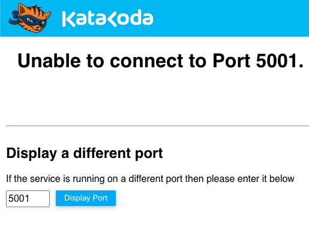
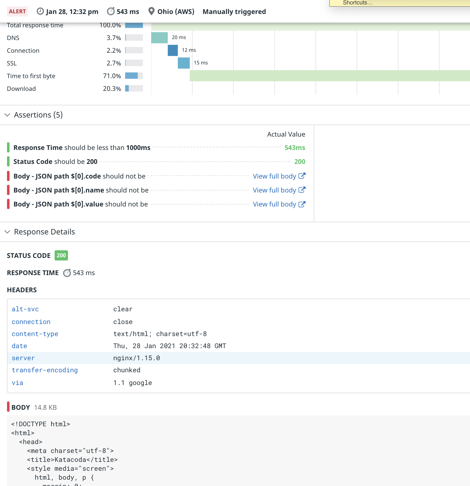

To see if this test would catch regressions following a deployment, you could hack the discounts service code to introduce a bug. The bug would need to cause very slow, non-200 OK HTTP responses to fail the test's assertions. An easy way to accomplish that is to simply shut the discounts service off!

1. In the lab terminal, stop the discounts service with the command `docker-compose stop discounts`{{execute}}.

2. Now click on the **Discounts API** tab to the right to see what happened. You should see a page from our lab platform stating that it can't connect to the discounts service port:

  

  The discounts service is definitely down!

3. Return to the API test you created in the Datadog app and click the **Run Test Now** button.

  Wait for the **Test Results** table to update with the latests results, or click the **Refresh** button in its header.

  You will probably see results with status **OK**, but there is a tiny chance that you'll see one or more expected **Alert** statuses. Why would it still be **OK**?

4. In the real world, the request to the broken service would probably time out or return an HTTP error code. This would definitely cause the assertions to fail.

  However, some services may return an information page, like this lab platform. This could lead to a false positive, so it's a good idea to create an assertion that confirms the type of content returning. 

## Update the API Test

1. In the lab terminal, restart the discounts service with the command `docker-compose start discounts`{{execute}} and give it some time to restart.

2. In the Datadog app, click the **gear button** in the upper-right corner of the Synthetics Test Details page for the API test. Select **Edit test details**.

3. Click the **Test URL** button. You should see the **BODY** section on the right filled with collapsed JSON objects.

4. Expand the the first JSON object and click on the `code` key. This will automatically create a [JSONPath](https://support.smartbear.com/readyapi/docs/testing/jsonpath-reference.html) assertion in the **Define assertions** section. This type of assertion allows you to specify which part of a JSON document you wish to evaluate.

  While this is a very useful shortcut for creating assertions based on the JSON response, the assertion it created is _too_ specific. The discount objects' values are likely to change over time, so they shouldn't be tested. 
  
  However, the object keys will remain the same. The assertion should be that the first object in the JSON document contains at least `code`, `name`, and `value` keys.

5. Change the logical operator from `contains` to `is not`.

6. Delete the value. Now this assertion will pass if the first object has the key `code`, and that its value is not empty:
  
  

7. Repeat the previous steps for the `name` and `value` key assertions. See if you can create one of them the "hard" way by clicking the **+ New Assertion** button.

8. Click the **Save Test** button, and click **Run Test Now** in the upper-right corner of the Synthetics Test Details page.

  Your improved test should pass with **OK** statuses in the **Test Results** section.

## Test for a failed assertion

1. Return to the lab terminal and stop the discounts service again with `docker-compose stop discounts`{{execute}}. 

2. Wait a few seconds, and then click **Run Test Now** from the Synthetic Test details page in Datadog. The tests should now fail, as expected:

  

3. To see the additional information that failed tests provide, click on one of results with **Alert** status. 

  You can see that the three new assertions failed, as expected. You can also see more detailed information about the response, including the headers and body, at the bottom of the screen. 
  
  This is provided to help you understand why the assertions failed. As you can see, the response body contained the "Unable to connect" HTML document, not the discounts JSON document:

  

Go back to the terminal and start the discounts service again with `docker-compose stop discounts`{{execute}}.

Now that you know how to create API tests and interpret their results, click the **Continue** button below to create a Browser Test.
