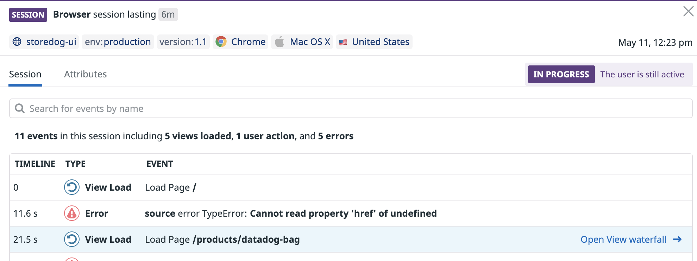

1. One of the major benefits that Datadog RUM offers is the ability to dive into granular data.

2. Click into one of the user sessions, and then one of the individual page loads:
  

3. By looking into this single view, you can see performance, resources, errors, and user actions associated with this page load. This data can be provided to the responsible engineers to help debug and rectify issues for your users.

4. Click on one of the user actions from the list, and you'll find a detailed view of how that action performed, any logs associated with it, what resources it used, and any errors that occurred because of the action.

5. Notice the button that says **Replay Session**? Click on it and you'll be shown a video of that user's session. 

  This way you can watch back how a user interacted with your site to determine what led to an error or performance issue. 