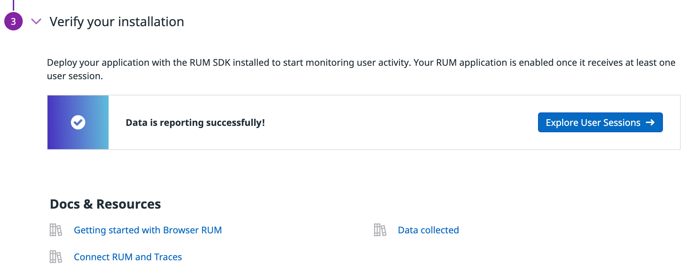

In the terminal on the right, the environment is being prepared. You will see a message `Provisioning Complete` along with some login credentials when the environment is ready.

Click the **IDE** tab on the right. It may take a few seconds to load. Once the IDE loads, open the file `docker-compose.yml`{{open}} to view the file in the editor. 

This docker-compose file brings the Storedog app online and instruments the Datadog agent and Storedog app services for monitoring with Datadog. 
     
Each application service runs in its own Docker container: `discounts`, `frontend`, `discounts-frontend`, `advertisements`, and `db`. (The `puppeteer` service is an extraneous container to generate simulated RUM traffic in this scenario.)

Let's configure Datadog RUM for the app.

### Configure Applications for Real User Monitoring

1. In a new browser window/tab, use the login credentials provided in the Terminal to log in to the <a href="https://app.datadoghq.com/account/login" target="_datadog">Datadog account/organization</a> that was created for you for this activity. Click the **Terminal** tab on the right to view the credentials.

  Note: If the credentials are not displayed in the terminal, run the command `creds`{{execute}} in the terminal.

2. To get started with RUM in Datadog, you need to set up a RUM Application. Navigate to <a href="https://app.datadoghq.com/rum/list" target="_datadog">**UX Monitoring > Real User Monitoring**</a>.

3. Click **New Application**.

4. Under **Set your application details**, select **JS** as the **Application type** because you are integrating the app using Javascript.

  Enter `Storedog`{{copy}} as the **Application name**.

  Click **Create New RUM Application**.

  > **Important:** It is important you name your application "Storedog" in this activity. In upcoming activities, the lab environment will be configured to automatically search for and use this application for RUM.

5. If you are using NPM to manage dependencies for your project front end, you can integrate RUM using the `@datadog/browser-rum` package. However, Storedog uses the inline JavaScript method, so select the **CDN Sync** tab.

  

  Notice that values for `applicationId` and `clientToken` are displayed in the generated code snippet. You will need these to set up RUM in your application.

  Also notice the other options you can set, including **Session Replay** and privacy settings for it, which allows you to see how users interact with your application but hides any sensitive data that may be entered.

6. To see where these values will go in this app, click the **IDE** tab to the right.  

  Open the file `store-frontend/app/views/spree/layouts/spree_application.html.erb`{{open}}. This Ruby file is the main template for the Storedog app. By integrating the RUM script here, RUM will be available throughout the application.

  **Lines 13-24** are the RUM script in the front end and set the initialization arguments. This code may be slightly different than the current code snippet in the Datadog UI. It will still work.

  **Line 20** connects associated APM traces to the RUM events. When you view RUM event details in the RUM UI, any associated traces will be displayed in the RUM event details.

  Notice that the code snippet includes environment variables for `applicationId` and `clientToken`.

  **Line 26** will initialize Session Replay, a feature of RUM that allows you to replay a user's session and identify any issues they may encounter. To address privacy concerns, the `defaultPrivacyLevel` option has been configured in the initialization to hide any sensitive data. 

7. Open the file `discounts-frontend/src/index.tsx`{{open}} to see how RUM is initialized in the React app.

8. Click the **Terminal** tab on the right. Let's set the environment variables for `applicationId` and `clientToken`.
    
  Copy the `applicationId` from the RUM UI page. In the terminal, assign the value you copied to `DD_APPLICATION_ID` using the `export` command: `export DD_APPLICATION_ID=<paste_application_id>`{{copy}}

  Copy the `clientToken` from the RUM UI page. In the terminal, assign the value you copied to `DD_CLIENT_TOKEN` using the `export` command: `export DD_CLIENT_TOKEN=<paste_client_token>`{{copy}}
  
  Run this command to verify that you saved the variables: `echo $DD_APPLICATION_ID $DD_CLIENT_TOKEN`{{execute}}

8. With the environment variables in place, you'll now have to build the Discounts frontend application to make sure the RUM script is included in the bundle.

  Run this command to set the environment variables for the React application and build it: 
    
  ```
  cd /discounts-frontend
  REACT_APP_DD_ENV=1.1 REACT_APP_DD_APPLICATION_ID=$DD_APPLICATION_ID REACT_APP_DD_CLIENT_TOKEN=$DD_CLIENT_TOKEN npm run build
  ```{{execute}}

9. When the build completes, use the `datadog-ci` library to upload the application's source maps with the following command:
    
  ```
  datadog-ci sourcemaps upload /discounts-frontend/dist \
      --service=discounts-frontend \
      --release-version=1.1 \
      --minified-path-prefix="${DISCOUNTS_FRONTEND_URL}"
  ```{{execute}}

  You'll learn more about this soon.

  > **Note:** You may receive a warning message after running the above command. That's okay, it will still work as expected. 
    
10. Now, navigate back to the Storedog directory with `cd /root/lab`{{execute}}.

11. Click `docker-compose -f docker-compose.yml up -d`{{execute}} to start the application's services. Docker will pick up the environment variables that have been set and pass them along to the containers.

  > **Note:** Make sure you are in the `/root/lab` directory when you run this command.

12. Give the services a few seconds to load up, then navigate to the Storedog and Discounts frontend apps in your browser by selecting the two tabs on the right. Take a moment and familiarize yourself with how the applications work, especially the **Discounts Frontend**.

  You'll notice a few pieces of the application are a bit buggy. For instance, fetching advertisements on click isn't working in the discounts app and there's some latency in both that app and the main storefront.

  Don't worry about it for now, you'll investigate these errors soon.

13. Now navigate back to RUM Application page in Datadog. After a few moments of gathering data, the section under **Verify your installation** should have a button titled **Explore User Sessions**, resembling this image: 

  

14. Click that button and you will be taken to the RUM Explorer page, where user session data is displayed. It may take a few moments for more data to come in. Explore this page for a moment or two, you'll use it soon to drill down into a user's session.

Now that the application is up and running with RUM, you'll want to give it a little time to send user session data. While that runs, this is a good time to explore the different tools at your disposal for monitoring your application.

Click **Continue** below.
