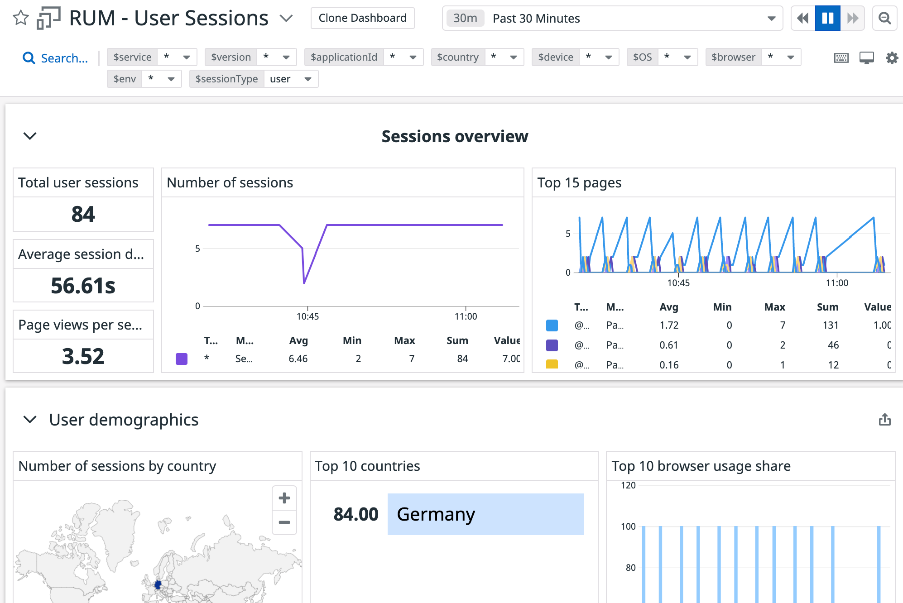

With the application running and the Puppeteer service simulating some traffic to the both frontend services, this is a good time to explore what is provided out of the box for you with RUM.

Navigate to the <a href="https://app.datadoghq.com/dashboard/lists/preset/3?q=RUM" target="_datadog">**Dashboards > Dashboard List**</a> page and you'll find a list of dashboards provided to you by Datadog. Some of these out of the box dashboards are specifically designed to help you get a good overview of your Real User Monitoring data. 

### User Sessions Dashboard

The User Sessions dashboard is a good place to get an idea of your user demographics. Here, you'll receive data about where your users are coming from, what pages are popular, what actions are being performed, and what errors are being reported. This is a great starting point to get a sense of your users and what they're doing.

1. Start by navigating to the dashboard titled **RUM - User Sessions**. You'll be brought to a dashboard that looks like the following image:

  

2. On this page, you'll get a general overview of user session data during the time period set in the upper-right of the page. 

  To get a better view, update this time to be the last 30 minutes.

3. This dashboard provides overall statistics such as the number of users, the average session duration, and the average number of page views per session.

  As you navigate further down the page, you'll find more fine-tuned data about the demographics of the users, such as what browsers they use, what device they use, and where they are located.

4. Navigate even further down the page and you'll begin to see how these users are interacting with the application throughout the session.

> **Tip:** Use the search tools at the top of the page to help filter the data by a number of different criteria.

### Mobile Dashboard

The mobile dashboard is great for identifying how your application is performing on mobile devices. Here, you can view information about what types of device you users are using, allowing you to filter the data by device type and version. 

1. Using the <a href="https://app.datadoghq.com/dashboard/lists/preset/3?q=RUM" target="_datadog">**Dashboards > Dashboard List**</a> page, navigate to the dashboard titled **RUM - Mobile**.

2. Explore the data in this dashboard and you'll find similar data to the one you saw in the previous dashboard, but this time it will be more specific to mobile devices.

3. In the search bar up top, find the **$OS** filter and select `iOS`. This allows you to get a better view of how your application is performing on devices running iOS.

4. Navigate further down the page and you'll find a list of any error data and crashes that have occurred in the application.

### Performance Overview Dashboard

The performance overview dashboard is where you can see how your application is behaving for users in terms of performance. You can see Core Web Vital stats, loading time averages, how long it takes for a user action to complete, and popular calls to an API over XHR or fetch.

1. From the <a href="https://app.datadoghq.com/dashboard/lists/preset/3?q=RUM" target="_datadog">**Dashboards > Dashboard List**</a> page, navigate to the dashboard titled **RUM - Performance Overview**.

2. While the previous dashboard focused more on the resources needed to make the application work, this dashboard focuses on how the application's performance affects the user experience.

3. The long tasks analysis section is where you can see how your application particularly responds to user actions. It identifies popular actions and how long they take to complete.

4. Further down the page, you'll get an overview of popular resources that are requested by the application to see how they perform and impact the user experience. 

  To get a better idea of resource performance, you can view the resource-specific dashboard.

### Resources

The resources dashboard is where you can get a better look at how your application is handling network requests. You'll find the most requested resources, how long they typically take to respond, and how large they may be. 

You'll also get a good look at how many requests are responding with HTTP status codes of `400` and higher, indicating some form of failure.

1. Using the <a href="https://app.datadoghq.com/dashboard/lists/preset/3?q=RUM" target="_datadog">**Dashboards > Dashboard List**</a> page, navigate to the dashboard titled **RUM - Resources**.

2. Use this dashboard to get a good look at how your application is utilizing different types of resources across different paths, locations, environment, or versions.

3. Look further down in the dashboard and you'll find a more detailed look at how long your application is taking to load, which is useful when trying to get a sense of performance issues when fetching these resources.

> **Tip:** Click on any of the data points in the graphs to view options on how to investigate the data even deeper.

### Errors Dashboard

1. Finally, take a look at the <a href="https://app.datadoghq.com/dashboard/lists/preset/3?q=RUM" target="_datadog">**Dashboards > Dashboard List**</a> page and navigate to the dashboard titled **RUM - Errors**.

2. This dashboard will give you an overview of how many errors and the types of errors that users have encountered during their sessions.

3. Take a moment and explore this dashboard, you may notice some errors are starting to come in from the Discounts frontend that may be worth looking into a bit more. 

4. You can click on the action `click on Get New Ad` to see more information about how this error happened, or you can navigate lower on the page to see if there are any code or network errors. 

  Notice at the bottom of the page it says to head to **Error Tracking** to investigate any errors that are persistently occurring. That's where you'll go next!

When you're ready to move on, go ahead and click the **Continue** button below, where you'll use Error Tracking to identify issues that may be persistent across your application.
