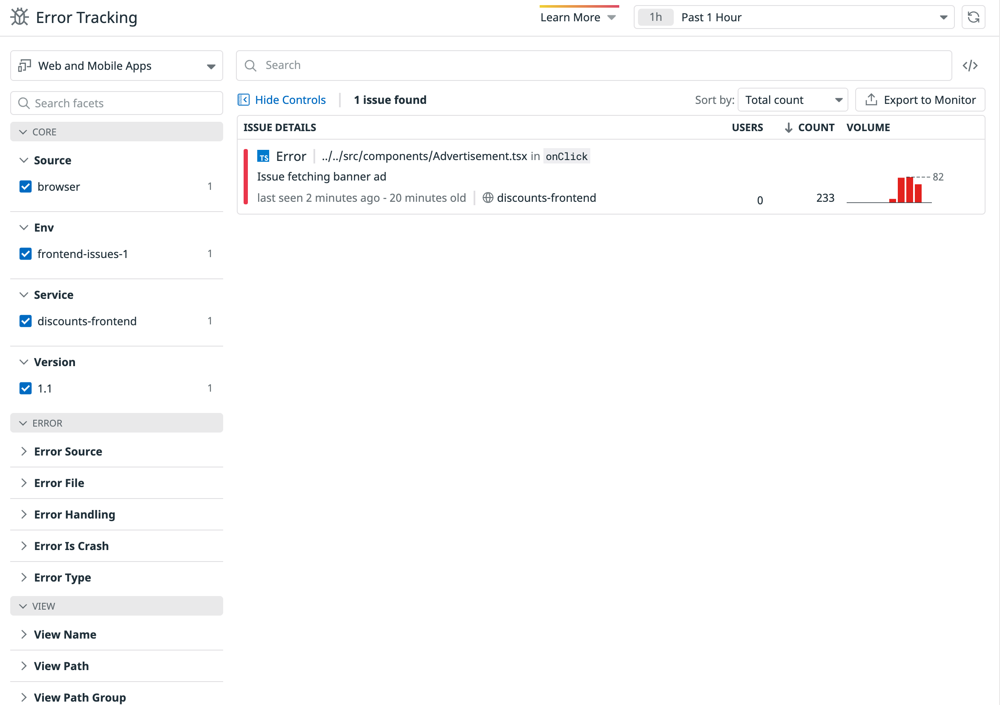
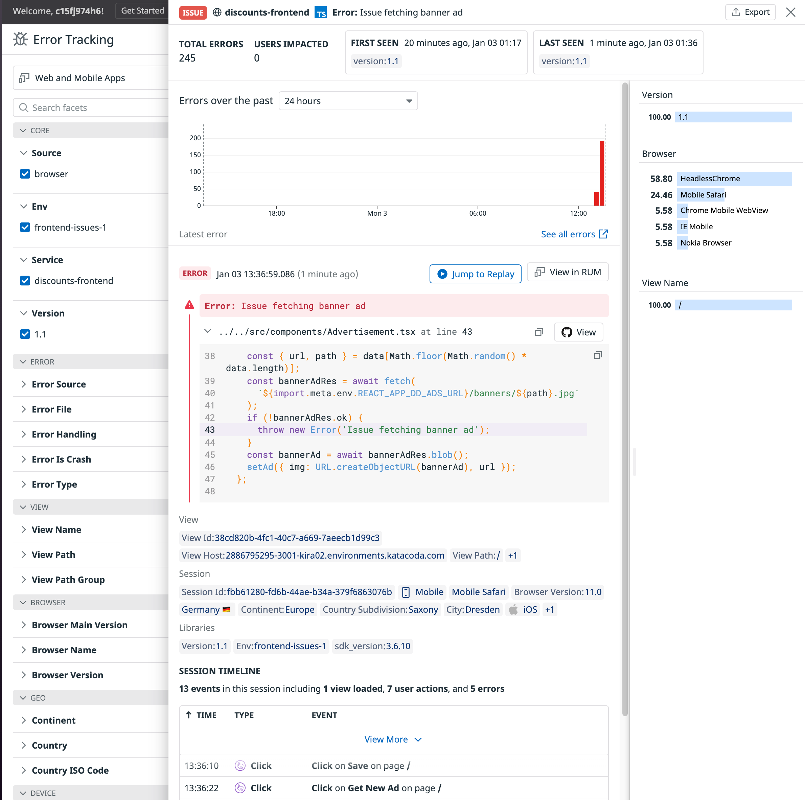

RUM Error Tracking in Datadog is a great way to see what errors are persistent throughout your application and how they are being handled.

In this step, you'll use Error Tracking to identify and error in your code.

1. Navigate to <a href="https://app.datadoghq.com/rum/error-tracking" target="_datadog">**UX Monitoring > Error Tracking**</a> and you'll see a page that looks like this image:

  

2. Here, you'll find a list of persistent errors occurring in your application. This means that one-off errors may not appear, but ones that users consistently come across will be highlighted.

3. You can use the facets menu on the left to help filter out the list of errors, giving you the ability to identify ones that may be more urgent, such as ones that cause crashes.

  You can also filter by versions, allowing you to accurately see if an issue was fixed by a new release.

4. Click on the error to the right with a message of **Issue fetching banner ad** to see the details of this error. You should see something like this image:

  

5. Because you uploaded the source maps with the `datadog-ci` tool earlier, Datadog can show you the line in the application's source code that caused the error. Without it, you would be shown where the error occurred in the minified JavaScript, which is not very helpful.

  Since the source maps were uploaded within the context of a GitHub repository, Datadog will provide a link to the repo so you can quickly file an issue and fix the error.

6. Further down this panel you'll find one of the sessions that led to this error. You can see the timeline of user actions, where they're from, and information about the device, all giving you greater insight into the error.

7. Also notice in this panel that you can click through to view more about this error in the RUM Explorer using the **Replay Session** and **View in RUM** buttons. You'll learn more about this next.

When you're ready to move on, go ahead and click the **Continue** button below, where you'll use the RUM Explorer to identify and begin to investigate how users are getting the error you just spotted.
