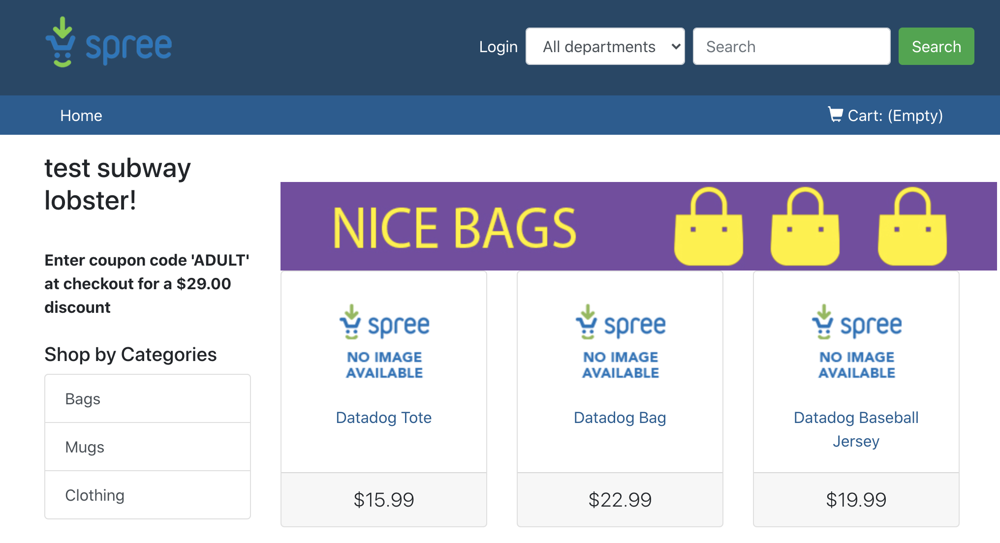

In this course you're going to work with Storedog, a fully functional e-commerce application running on a few Docker containers managed by Docker Compose.

Here's a summary of the services that comprise Storedog:

| Service        | Purpose                                                                              |
| -------------- | ------------------------------------------------------------------------------------ |
| db             | PostgreSQL database used by all services                                             |
| frontend       | Spree, an open source e-commerce framework written in Ruby                           |
| discounts      | Python Flask API that serves store item discounts                                    |
| advertisements | Python Flask API that serves advertisements                                          |
| puppeteer      | Puppeteer will be used to simulate user traffic and interaction with the application |

1. Click the IDE tab and wait for the editor to load. It takes a bit.

  Open the `docker-compose.yml`{{open}} file and review how these services are configured.

1. (Optional) The code for the Storedog services is available in the IDE file explorer, if you'd like to look at it.

1. The application is already running. To see the containers, execute the following command in the terminal:

  `docker-compose ps`{{execute}}

1. Select the tab titled "storedog" in the right-hand panel. This will open up Storedog as a new tab in your browser. You might need to refresh until the frontend service is fully responsive.

  

1. Take a few moments and explore the application before moving on. You'll use this application throughout the rest of the course to learn about the Datadog platform.

