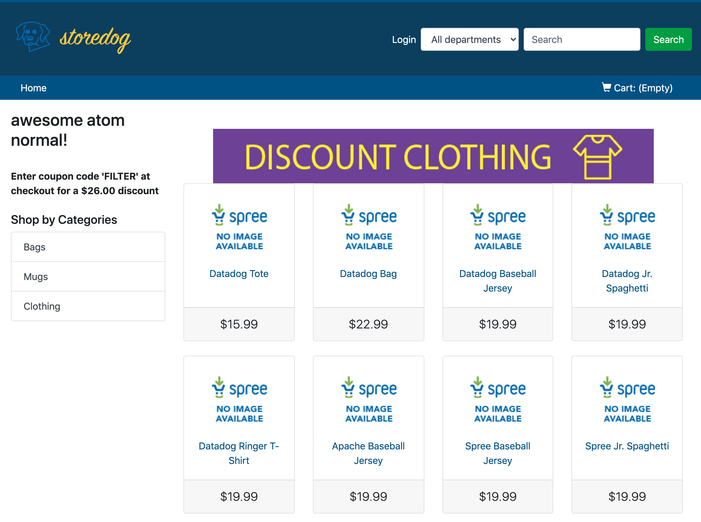

Understanding user experience in the app is an important step for determining relevant SLOs. 

Consider what users would do in the app and what critical user journeys should be reliable. For an e-commerce app like Storedog, users would reasonably expect to view the home page, log in, search for items, view item details, manage items in their cart, and check out items for purchase.

Let's create SLOs for two user experiences: viewing the storedog home page and managing items in their cart.

1. Click the **storedog** tab to the right. A new browser tab will open for the Storedog app. 

2. Notice how long it takes the home page to load. 

   If the home page took too long to load, users would not be happy with the app's performance. 
   
   You can create an SLO related to the *latency of viewing the home page*.

3. Click 2 or 3 different products in the app and add items to the cart.

   If users are unable to add items to a cart—one of the most important user actions in an e-commerce app—users will probably switch to another app. 
   
   You can create an SLO related to *successfully managing items in the cart*.

With some SLOs in mind, let's explore the available metrics in Datadog that you can use for SLIs.