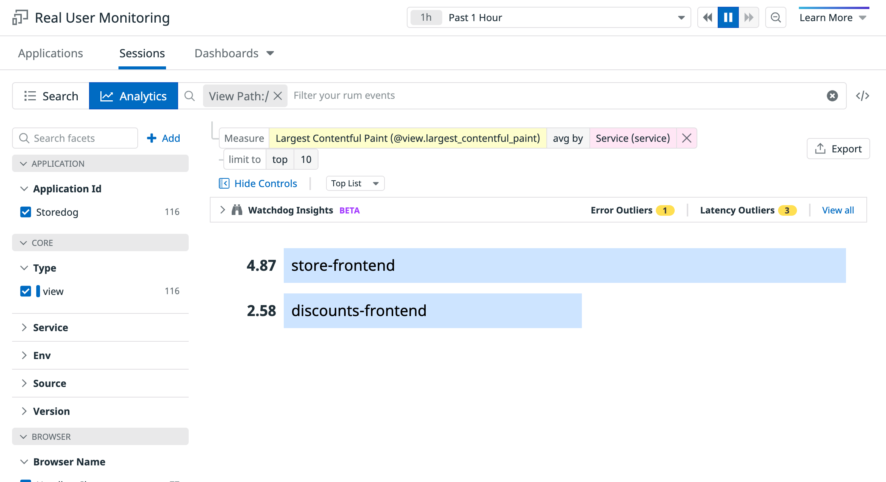
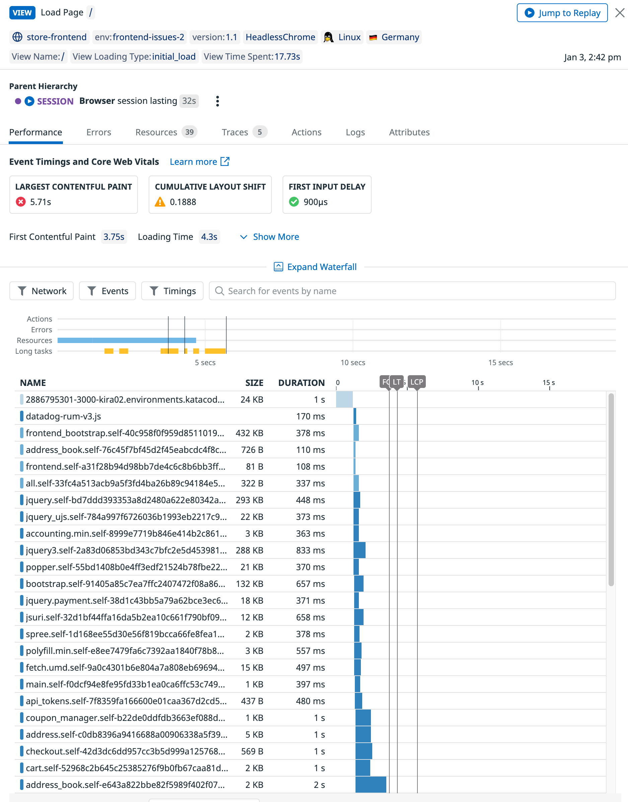
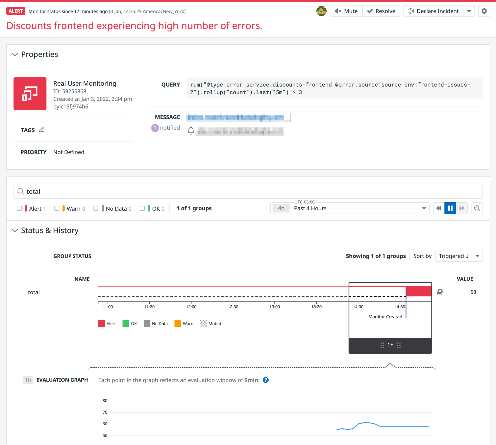

The monitor you just created will take a moment or two before it's sending alerts, so it's a good opportunity to take some time to think about other issues your application may have.

Here, you'll take a look at the **RUM Analytics** to identify performance issues between your two frontend services to help prioritize where time should be spent. Then you'll revisit the monitor to see if it's sending an alert.

1. Navigate to the <a href="https://app.datadoghq.com/rum/analytics" target="_datadog">**UX Monitoring > Analytics**</a> page and you'll be able to see how your application's are performing at a higher level.

  Rather than diving into individual user sessions, you can use this tool to track trends in your services and how they respond to both user input and their interactions with other services and APIs.

2. For now, take a look at the Largest Contentful Paint (LCP) metrics for the Storedog frontend and Discount frontend services. Having a high LCP can lead to a poor user experience and ultimately will cause users to drop the session, so it's important to keep an eye on these metrics and not just errors experienced by users.

  Set the filter bar at the top of the page to filter by `@view.url_path:"/"`{{copy}}, this way we can compare how both services' home pages are performing.
  
  Then set the **Count** value to `Largest Contentful Paint` (or `@view.largest_contentful_paint`{{copy}}) and **avg by** a value of `Service (service)`.
  
  > **Note:** The **Count** label may say **Measure** instead when you change the value.

  Finally, update the **Timeseries** option to have a value of `Top List` instead. This will give you a clear breakdown of which service has a worse LCP at the moment.

  The result should look something like this:

  

3. The **store-frontend** service seems to be experiencing a poor LCP metric, so it's safe to say this is where you may want to focus on next for performance improvements.

  Click on the service name to and then select **View events** from the menu, then select one of the events to see how it performed. It should look something like this image:

  

4. Navigate through this waterfall list and filter by the different types of resources to get a better sense of what's taking so long.

  You'll notice that there are a number of JavaScript file and images that take a while to load, and then a few fetch requests are made after the page loads for advertisement and discount data. All of this adds up to a high LCP value.

5. From this list, click on the entry for **discount** to see a flame graph of the request and its associated APM trace. Here, you'll see that the discounts service is performing okay, but it still has to wait for the page to load before it can be fetched.

  This is a performance issue that needs to be addressed and may not have been found if it weren't for this ability to see how the page performs.
  
  The good news is you've identified both the issue and what the potential next steps are, which may be to fetch the ads and discounts before the page loads and serve it with the rest of the page on load.

6. Navigate back to the monitor you created earlier from the <a href="https://app.datadoghq.com/monitors/manage" target="_datadog">**Monitors > Manage Monitors**</a> page and you'll find that it's starting to send an alert, as the next image shows:

  

  You may have also received an email notification about it if you entered it in the last step.

In the next and step, you'll fix the error so you can witness the monitor return back to an **OK** status. While you're at it, you'll also add some custom data to the Discount frontend's user events so you can capture more meaningful information about each user's session.

Click the **Continue** button below to move on to the next step.
