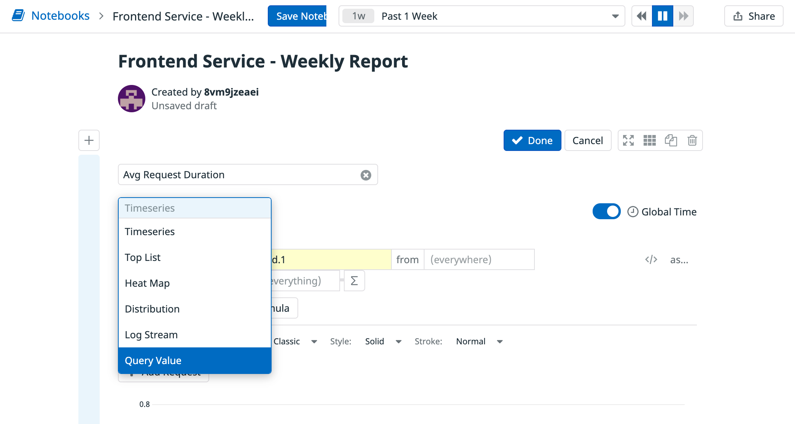
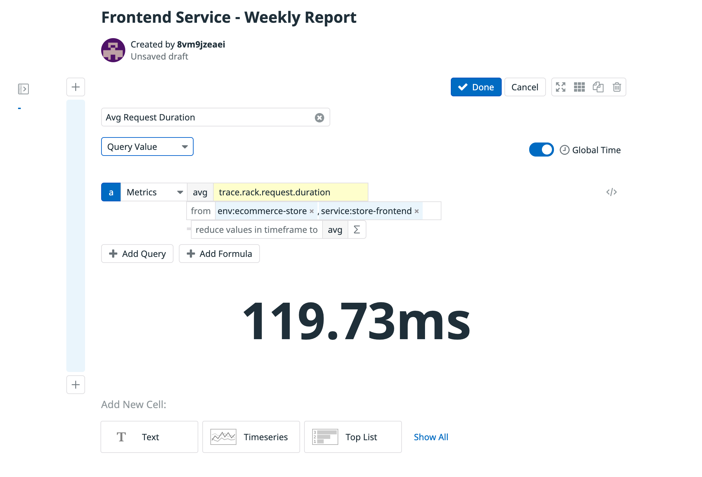
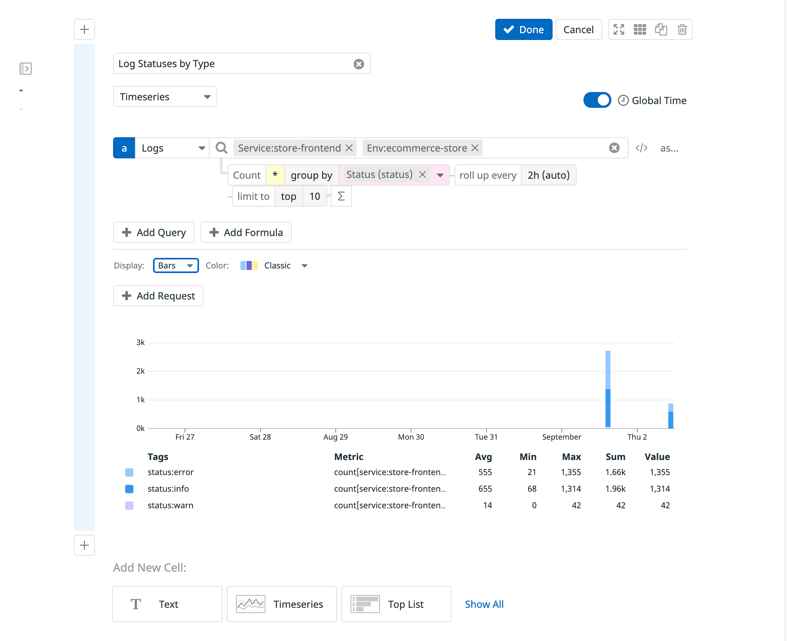

In the terminal on the right, the Storedog app is being instrumented for APM with Datadog. Live traffic to the app is also being simulated. This may take a minute or two. Once the app is running, you will see the message `Provisioning Complete` in the terminal along with your Datadog login credentials.

Once the initialization completes, you can browse the Storedog app by clicking on the `storedog` tab in the terminal to the right. 

Throughout this lab, you will use a notebook to report on the frontend service of this application's health and correlate it with software release notes over the span of a week.

## Log In and Confirm Logs are Collected

In a tab, log in to the <a href="https://app.datadoghq.com/account/login" target="_datadog">Datadog training account</a> that was created for you for the lab. If you need to recall your credentials, type `creds`{{execute}} in the terminal.

Navigate to the <a href="https://app.datadoghq.com/logs" target="_datadog">application's Logs page</a> to confirm logs are being captured. There isn't anything in particular you need to look for here, just confirm that the `store-frontend` service is being logged.

## Create Your Notebook

Next, navigate to <a href="https://app.datadoghq.com/notebook" target="_datadog">Notebooks > New Notebook</a> to create a new notebook by following these steps:

1. Name the notebook `Frontend Service - Weekly Report`{{copy}}, then set the time span to be `Past 1 Week` towards the top of the page.

1. When you started the new notebook, a cell was added with a sample Timeseries graph to get you started. 

  First, give it a name of `Avg Request Duration`{{copy}} in the input box at the top of the cell. Then select the dropdown menu with a value set to "Timeseries" and select the "Query" option. It should look something like this image:

  

1. Now set it up so the cell's is set to query "Metrics" with a value of `trace.rack.request.duration`{{copy}} from `env:ecommerce-store, service:store-frontend`{{copy}}. The result should be the duration displayed in the cell, resembling this image:

  

> **Note:** The `env:ecommerce-store` and `service:store-frontend` facets were created for you when the application was instrumented and can be found in the `docker-compose.yml` file in the IDE tab.

1. Go ahead and save the cell, either by selecting the cell's `Done` button or clicking anywhere outside of the cell.

1. Now create another cell below the one you just created. This time, make it a "Timeseries" cell with a name of `Log Statuses by Type`{{copy}}.

1. For this cells query, set it to query `Logs` with a value of `Env:ecommerce-store, Service:store-frontend`{{copy}} and set the "group by" option to be `Status(status)`{{copy}}`.

  The result should be a line graph of the status of the application broken out by status. To make it more readable, set the "Display" option to be `Bars`, resulting in something that looks like the following image:

  

> **Tip:** You can adjust the size of each cell's content by selecting the `Edit` button and then the `Graph Settings` button to the right of it.

1. Save the cell, then create one more below it. This time, create a "Text" cell with the following Markdown content and save it:

```md
## Release Notes
```{{copy}}

1. Now save the notebook by selecting the `Save Notebook` button on the page.

With your notebook created and set up to pull a report of the frontend service's health, select the **Continue** button to move on to the next step, where you'll learn how to query a notebook's data using the Datadog API.
