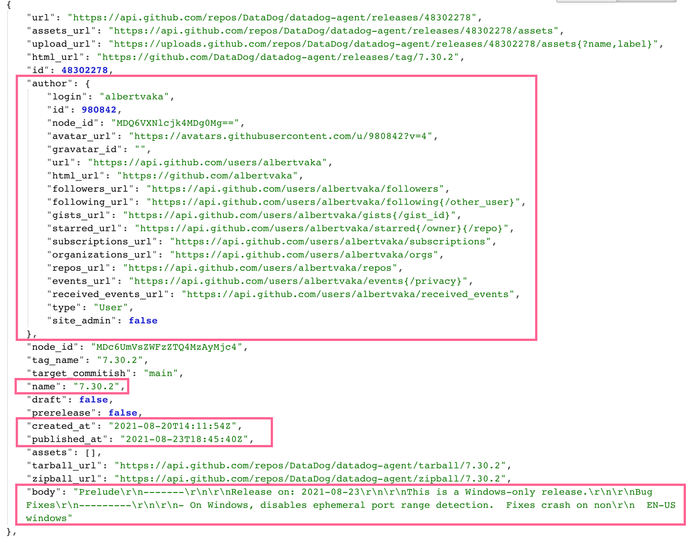
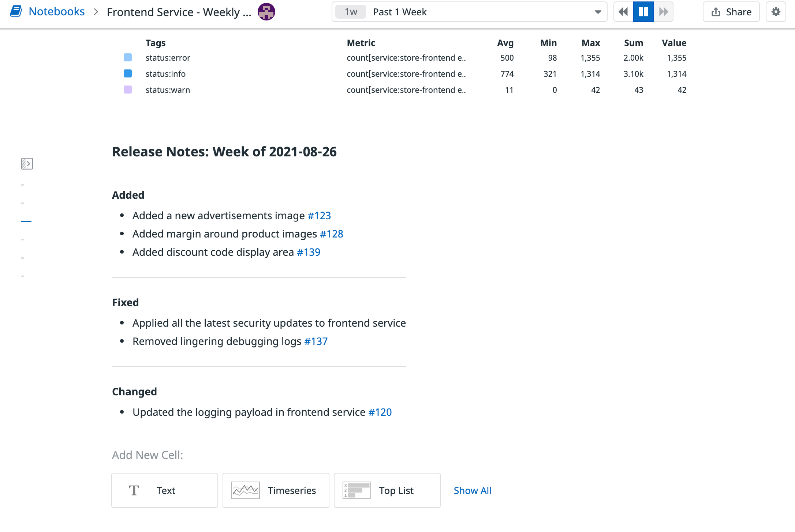

While your notebook in its current state displays good information about the application, it may not be enough to provide a full picture of what actually happened during the week to produce such metrics. For some, it may be helpful to correlate an application's performance with other data sourced from services such as PagerDuty or Jira. 

In this step, you'll update your notebook with release notes from the application's repository.

## Get Release Notes Data from GitHub

To start, take a moment and examine the release data returned for a repository from the GitHub API. As an example, take a look at the data returned for the Datadog Agent's repository:

```
curl -G \
  "https://api.github.com/repos/datadog/datadog-agent/releases?per_page=5" | jq
```{{execute}}

Use the following image as a reference of what a single release looks like and where to locate some of the data you may want to consider including in your notebook:



Unfortunately the GitHub API doesn't allow you to query for a span of time, so you'd need to identify all of the releases that were created within that time frame and filter out the rest.

Another thing to be mindful of is how the release notes stored in the `body` field are formatted. You'll want to make sure you're getting the data in the format that serves you best for your notebook.

> **Note:** For this lab, the JSON data will be provided to you in a way that is already formatted and valid for the Datadog API.
>
> To get a better understanding of what is expected by the API to update a notebook, check out the <a href="https://docs.datadoghq.com/api/latest/notebooks/#update-a-notebook" target="_datadog">Datadog Notebook API documentation</a>.

## Update Notebook with Release Notes

Updating a Datadog notebook with the API is a complete overwrite, so existing cell data will need to be part of the request body.

In the **IDE** tab, open the `update_notebook.sh`{{open}} file and you'll find a script for updating your notebook, complete with the request body already formatted. 

The first two cells are in place to keep the notebook's existing data intact. The third cell has been updated to help you identify which time span you're viewing.

A fourth cell has been added to include the release note data from the GitHub API. They are grouped by the type of change made and also include links to the relevant GitHub issue or pull request. For this lab, however, none of the links will go anywhere.

Run this script in the terminal to update the notebook:

```
bash update_notebook.sh
```{{execute}}

The response should be the notebook's new content, resembling the body of the request. Go ahead and view your notebook in the <a href="https://app.datadoghq.com/notebooks/list" target="_datadog">Datadog app</a>, which should look something like this image:



Great work! Now you can see what work was done in the previous week and how it impacted the application's health and performance, all in one place. This gives you a more holistic view of your application and if the work being performed is effective.

While the script provided in the `update_notebook.sh` file is a good starting point to see what's possible, consider how you can make it more flexible and customized to your needs. With the <a href="https://docs.datadoghq.com/api/latest/" target="_datadog">Datadog API</a>, you can write scripts much like this one in a number of programming languages that automates report generation for you.

Select the **Continue** button to move onto the next step, where you'll learn what options are available for you to share your notebook with teammates and stakeholders.

