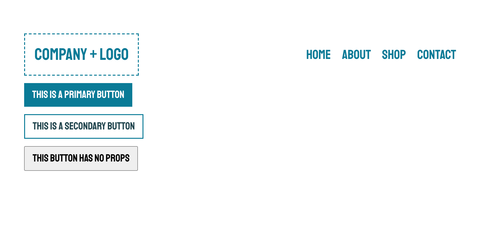

In this step, we're going to extend upon this component by accepting props that will dictate the style the button appears in.

> **Important:** Make sure you're in the correct branch, `step-2`. Use the terminal or VSCode window to switch between branches.

## Add Primary and Secondary Variants

Let's define what types of variants we'll have. Add the following code below the import statements in `./src/components/Button/index.jsx`{{open}}:

<pre class="file" data-filename="./src/components/Button/index.jsx" data-target="insert" data-marker="#step-2_1">const BTN_VARIANTS = {
  PRIMARY: &#x27;primary&#x27;,
  SECONDARY: &#x27;secondary&#x27;,
};
</pre> 

Let's now define styles for our variants by checking prop values using JavaScript. Add the following code into the `StyledButton` definition right under the defined styles:

<pre class="file" data-filename="./src/components/Button/index.jsx" data-target="insert" data-marker="#step-2_2">${(props) =&#x3E; {
    if (props.variant === BTN_VARIANTS.PRIMARY) {
      return css&#x60;
        background-color: ${theme.button.primary.bg};
        border: 1px solid ${theme.button.primary.bg};
        color: ${theme.button.primary.text};
        &#x26;:hover {
          background-color: ${theme.button.primary.bgHover};
          color: ${theme.button.primary.textHover};
        }
      &#x60;;
    } else if (props.variant === BTN_VARIANTS.SECONDARY) {
      return css&#x60;
        background-color: ${theme.button.secondary.bg};
        color: ${theme.button.secondary.text};
        border: 2px solid ${theme.button.secondary.border};
        &#x26;:hover {
          background-color: ${theme.button.secondary.bgHover};
          color: ${theme.button.secondary.textHover};
        }
      &#x60;;
    }
  }}
</pre>

Here, we execute a function that accepts the `props` object as a parameter.This is how styled-components allows us to dynamically set styles based on prop data. Specifically, we check the `props.variant` value against our `BTN_VARIANTS` object.

Let's see how they look!

## Add to App and Test

In `./src/App.jsx`{{open}}, we already have the Button component imported, so let's see how these variations look by adding the following code to the returning JSX:

<pre class="file" data-filename="./src/App.jsx" data-target="insert" data-marker="#step-2_4">&#x3C;div style={{ margin: &#x27;16px 0&#x27; }}&#x3E;
        &#x3C;Button variant=&#x27;primary&#x27;&#x3E;This is a primary button&#x3C;/Button&#x3E;
      &#x3C;/div&#x3E;
      &#x3C;div style={{ margin: &#x27;16px 0&#x27; }}&#x3E;
        &#x3C;Button variant=&#x27;secondary&#x27;&#x3E;This is a secondary button&#x3C;/Button&#x3E;
      &#x3C;/div&#x3E;
      &#x3C;div style={{ margin: &#x27;16px 0&#x27; }}&#x3E;
        &#x3C;Button&#x3E;This button has no props&#x3C;/Button&#x3E;
      &#x3C;/div&#x3E;
</pre>

Here, we provide a number of variations of the Button component so we can see how it looks with different prop values.

Now let's test it out! Run the following command to start the development server:

`npm run dev`{{execute}}

Now open the [**Main Site**](https://[[HOST_SUBDOMAIN]]-3000-[[KATACODA_HOST]].environments.katacoda.com) tab.

The page should now look something like the following image:

Our Button component now renders in different styles based on passed in prop data. We should probably account for what happens if you pass in an incorrect prop, or no props at all, as that last button doesn't look too great compared to the others.

## Save Your Work

Before moving on, take a moment and save your work. Then checkout into the next step's branch to ensure a clean environment. Do so by running the following commands:

`git add -A
git commit -m 'feat(step-2): adds button component variants'
git checkout step-3
`{{execute interrupt}}

In the next step, we'll use the PropTypes library to set expected prop data and provide default prop values for our component and support the developer's experience using the component.

Let's take a quick knowledge check:

>>Question: What would happen if we passed in `size="large"` as a prop if we didn't define it in our component?<<
( )  It will break the component because we don't explicitly mention it in our component's styles.
( )  It will make the button larger.
(*)  Nothing will happen because we don't look to style our component any differently based on its value.

