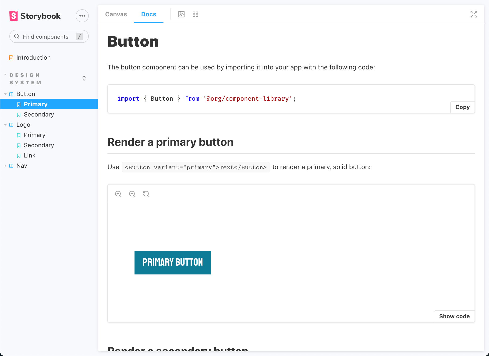

In this final step, we're going to add documentation for the Button component we just created, allowing developers to identify how to properly use it.

Storybook is the tool we'll be using for the documentation, as it specializes in documenting these types of libraries.

> **Important:** Make sure you're in the correct branch, `step-4`. Use the terminal or VSCode window to switch between branches.

## Set Up Documentation

First thing we need to do is create a file to hold our documentation for Storybook. Run the following command to create the file:

`touch ./src/components/Button/Button.stories.mdx`{{execute}}

If you're unfamiliar with MDX, that's okay. All we need to know is it allows us to combine the text formatting of Markdown and functionality of a React component using JSX! Open the file in the IDE by selecting the next file path:

`./src/components/Button/Button.stories.mdx`{{open}}

In this file, let's import our dependencies. Select this code to place it into the file:

<pre class="file" data-filename="./src/components/Button/Button.stories.mdx" data-target="append">import {
  Meta,
  Story,
  Preview,
} from &#x27;@storybook/addon-docs/blocks&#x27;;

import { Button } from &#x27;./index&#x27;;

</pre>

Then let's set up some information about the page so Storybook knows what it's all about. Add the following code:

<pre class="file" data-filename="./src/components/Button/Button.stories.mdx" data-target="append">&#x3C;Meta title=&#x27;Design System/Button&#x27; component={Button} /&#x3E;

export const Template = (args) =&#x3E; &#x3C;Button {...args} /&#x3E;;

# Button

The button component can be used by importing it into your app with the following code:

&#x60;&#x60;&#x60;js
import { Button } from &#x27;@org/component-library&#x27;;
&#x60;&#x60;&#x60;

</pre>

Here, we use the Storybook `Meta` component to define the title of this page in the documentation and provide context as to what component we're documenting.

We also export our component as a variable called `Template`. We'll see how this is used next, but it essentially allows Storybook to bind prop data to our component so it can be updated in real-time!

We then begin our documentation by explaining to the user what this component is and how to import it.

> **Tip:** You can install the [MDX extension](https://marketplace.visualstudio.com/items?itemName=silvenon.mdx) from the VSCode marketplace for syntax highlighting in MDX files.

## Create Stories

Each defined use of a component in Storybook is known as a "Story". Using stories helps demonstrate how the component can be used with certain props.

Add the following Story definitions to the file with this code and we'll be done with our documentation:

<pre class="file" data-filename="./src/components/Button/Button.stories.mdx" data-target="append">## Render a primary button

Use &#x60;&#x3C;Button variant=&#x22;primary&#x22;&#x3E;Text&#x3C;/Button&#x3E;&#x60; to render a primary, solid button:

&#x3C;Preview withToolbar&#x3E;
  &#x3C;Story
    name=&#x27;Primary&#x27;
    args={{
      variant: &#x27;primary&#x27;,
      children: &#x27;Primary Button&#x27;,
      onClick: () =&#x3E; alert(&#x27;this button was clicked&#x27;),
    }}
    argTypes={{
      variant: {
        name: &#x27;Variant&#x27;,
        description: &#x27;Render different variants of the Button&#x27;,
        control: {
          type: &#x27;select&#x27;,
          options: [&#x27;primary&#x27;, &#x27;secondary&#x27;],
        },
      },
    }}
  &#x3E;
    {Template.bind({})}
  &#x3C;/Story&#x3E;
&#x3C;/Preview&#x3E;

## Render a secondary button

Use &#x60;&#x3C;Button variant=&#x22;secondary&#x22;&#x3E;Text&#x3C;/Button&#x3E;&#x60; to render a secondary, outlined button. This can be used to create contrast and help distinguish actions a user can take when compared to a primary button.

&#x3C;Preview withToolbar&#x3E;
  &#x3C;Story
    name=&#x27;Secondary&#x27;
    args={{
      variant: &#x27;secondary&#x27;,
      children: &#x27;Secondary Button&#x27;,
      onClick: () =&#x3E; alert(&#x27;this button was clicked&#x27;),
    }}
    argTypes={{
      variant: {
        name: &#x27;Variant&#x27;,
        description: &#x27;Render different variants of the Button&#x27;,
        control: {
          type: &#x27;select&#x27;,
          options: [&#x27;primary&#x27;, &#x27;secondary&#x27;],
        },
      },
    }}
  &#x3E;
    {Template.bind({})}
  &#x3C;/Story&#x3E;
&#x3C;/Preview&#x3E;

</pre>

Here, we pass in some default prop data as `args` and we also instruct Storybook how to handle some of the prop data in `argTypes`. 

The `Template.bind({})` function will take all of the context added to the `Story` component and pass it down into the rendered Button.

These will show users how to render a Primary and Secondary button and what they actually look like on a page.

Now let's see how it all looks.

Because this is running through Storybook, we are going to run this different command instead:

`npm run storybook`{{execute}}

Navigate to the documentation by selecting the [**Documentation**](https://[[HOST_SUBDOMAIN]]-6006-[[KATACODA_HOST]].environments.katacoda.com) tab in the dashboard. The resulting page should list all of the defined components, including our Button, as the following image shows:

Explore a little bit and get familiar with Storybook. Use the **Docs** tab in Storybook to see all of the documentation we've written at once, including the table of possible prop argument values.

We can even switch to the **Canvas** tab in Storybook, which allows us to update the props for a component in real-time and let us preview on the fly!

Now our Button has been built and documented, allowing other developers to learn how to use it. Great work! 

Let's recap everything we learned on the following page. But first, let's take one final knowledge check:

>>Question: What Storybook component allows us to name and organize our component's documentation for users?<<
(*)  Meta
( )  Preview
( )  Story
( )  ArgsTable
