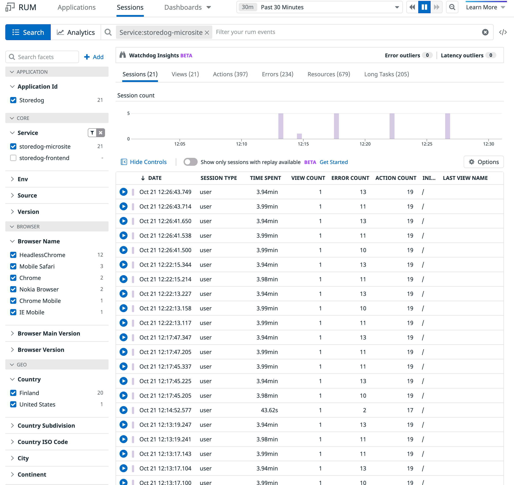
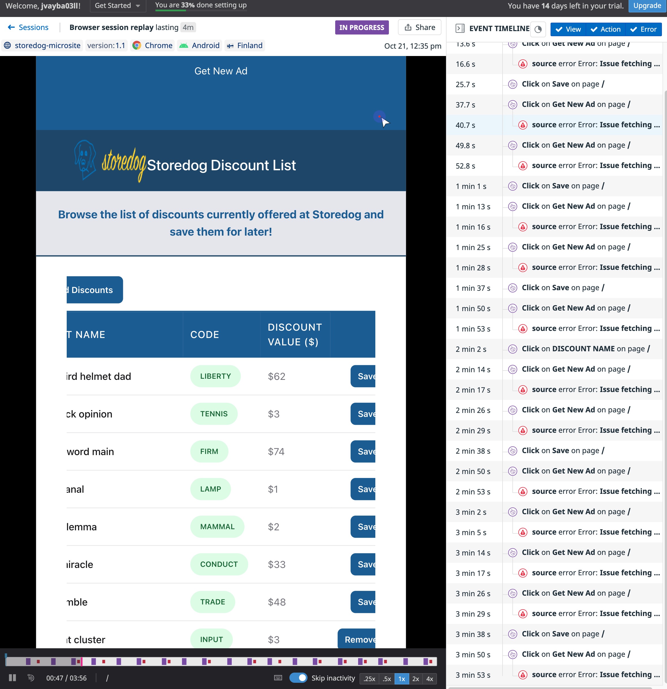
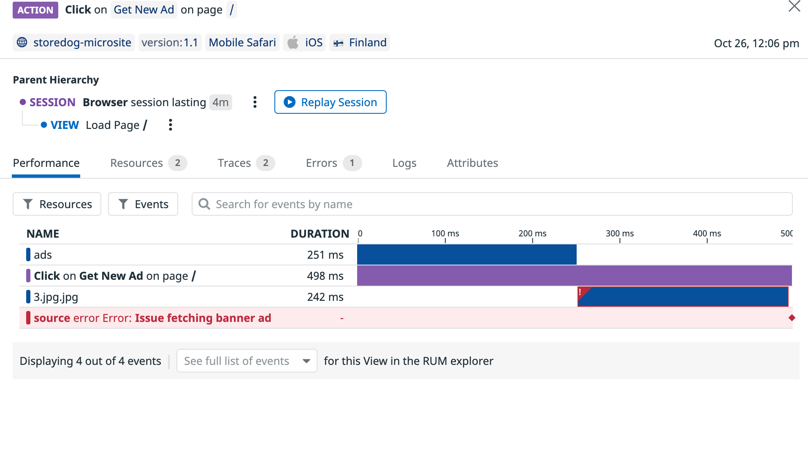

As you just saw, RUM makes it easy to get a high-level view of your application's health and how it may be affecting users. This allows you to prioritize and address issues that may be impacting your application and its users.

Now you're going to use the RUM Explorer and Session Replay to investigate a specific issue and see where it is failing in your application. 

1. Navigate to the <a href="https://app.datadoghq.com/rum/explorer" target="_datadog">**RUM Explorer**</a> page.

  From this page, you can see information about user sessions, errors encountered, what pages were viewed, and other important information that allows you to understand what's going on in your application. It should resemble this image:

  

2. On the left-hand side, you'll find a list of facets you can use to help filter this data.
  
  If you explored either application earlier, you may even find your own session by toggling the **GEO > City** facet.

3. In the search box at the top of the page, remove any existing filters and search for data from the Storedog microsite with `Service:storedog-microsite`{{copy}}

4. Click on one of the sessions that has 19 actions associated with it. The session should look like this image:

  

  Here, you can see exactly what path the user took in the application and when the error occurred throughout their session.

  In this menu, you can also view only the errors or the attributes of the user that had the errors, which makes it easier to see if the issue is specific to a user's environment or location.

5. Another feature at your disposal is **Session Replay**, which was turned on when we instrumented the applications earlier. Select that button now to see a screen like this:

  

  This feature allows you to watch back the user's session and see what actions were taken that led them to the error.

  Watch the video and you'll notice the error occurred after the user selected the "Get New Ad" button on the site. 

6. On the right-hand side, find one of the user actions that says **Click on Get New Ad**. Hover over it and click on the **Details** icon on it to get a deeper view of the action that led to this error.

  

  Look deep enough and you'll notice that the request was made to a banner endpoint with two `.jpg` extensions. Now that you have an idea of what the problem is, see if you can find where it happened.

7. Click on the **Traces** tab to see a flamegraph of how the request performed. This works because you instrumented the application with the `allowedTracingOrigins` option, enabling APM tracing.

8. Click on the **Errors** tab and you'll get a detailed view of any errors and where they can be found in the source code, resembling the issue you just saw on the Error Tracking page.

9. Notice in the source code that there's an extra `.jpg` extension on the end of the URL: 

  ```jsx
  const bannerAdRes = await fetch(
      `${process.env.REACT_APP_DD_ADS_URL}/banners/${path}.jpg`
    );
  ```

  It seems the `path` variable already has a `.jpg` extension, so you don't need to have the second one. Now that you know where it happened, you will have a much easier time fixing it.

Great work using RUM to identify, diagnose, and fix issues in your application. With dashboards, the RUM Explorer, and Session Replay, you have the ability to see what's going on in your application and how any errors may affect users.

Before you fix it, however, it's worth considering how you would have found this error if you weren't already looking for it. With this error identified, you can now create a monitor for it to be alerted if it were to happen again.

Click **Continue** below to finish this first part of the workshop.
