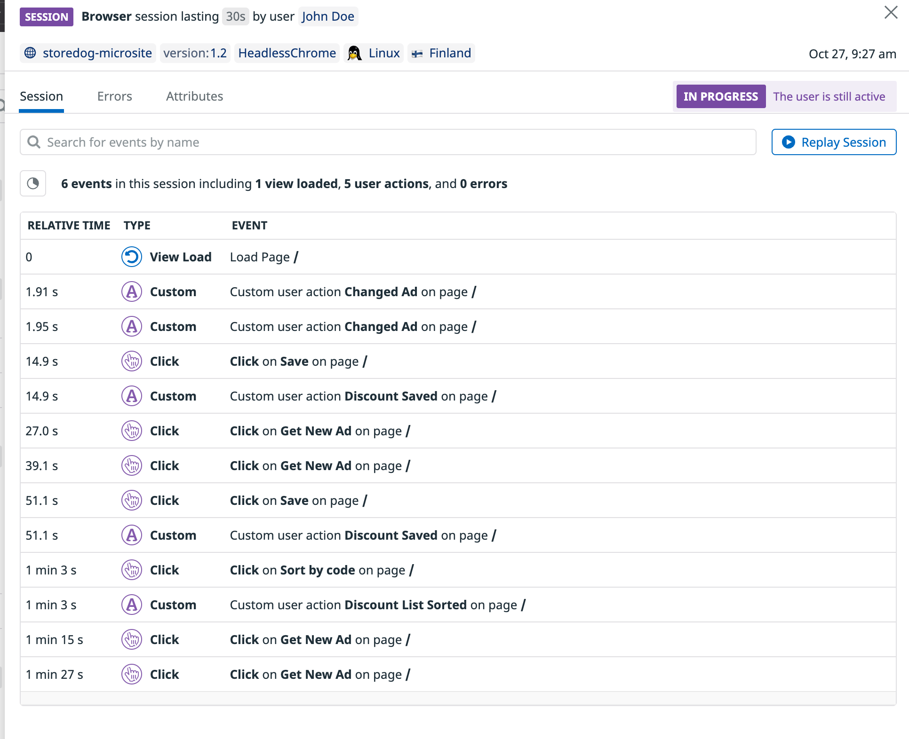
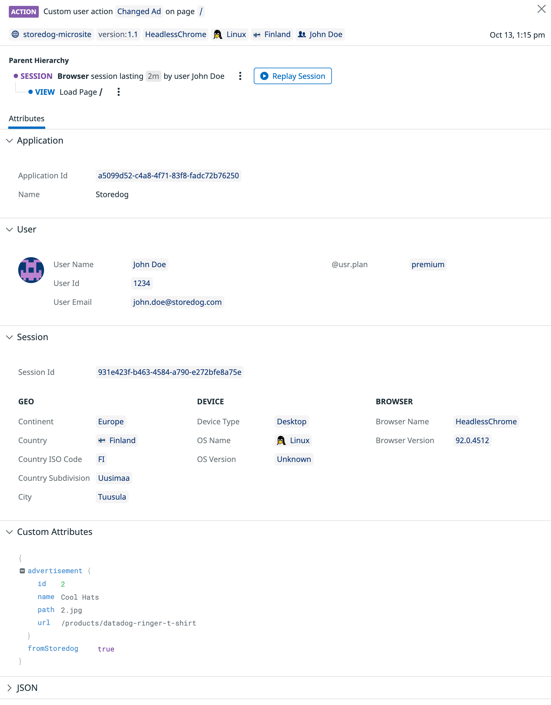
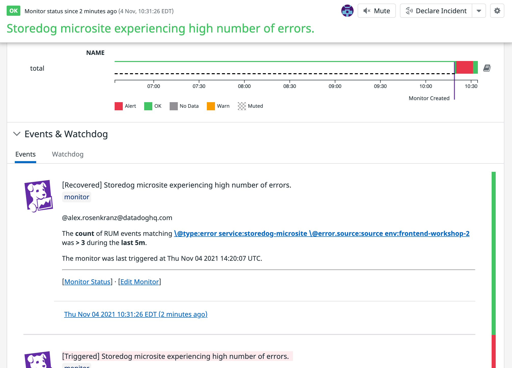

In this final step, you'll confirm the fixes and custom RUM configuration you implemented previously are working.

### View custom action data

1. While you wait for the monitor to leave its **Alert** state, navigate to the <a href="https://app.datadoghq.com/rum/explorer?tab=session" target="_datadog">**RUM Explorer**</a> page.

2. To ensure you're viewing the newer user sessions for the microsite, filter the sessions with `Service:storedog-microsite` in the bar at the top of the page and change the time value in the upper-right corner to `Past 5 Minutes`.

3. It may take a moment or two to generate user session data but once it does, select one with a good amount of user actions and you'll see something like this image:

  

4. As you can see, instead of the sorting click actions saying **DISCOUNT NAME ▼**, they now say the name of the column was sorted, such as **Sort by name**.

5. Also notice the actions labelled **Custom**. These are the results of your implementation of custom actions. Click on one for **Changed Ad** to get a better view of it. 

  

6. In this view, you'll notice under **User** that the user you set in `index.tsx` is displayed. This allows you to correlate what type of advertisements are being served to this user, giving you insight into both the application's performance for this user and potential key marketing data.

7. Look further towards the bottom of this view for **Custom Attributes**. This is the data you sent along with the custom action and is now available to be used by Datadog.

  Click on the `name` for the advertisement, then select `Create facet for @context.advertisement.name` to create a new facet to filter by. This makes it easier to identify if any particular ads are related to errors, performance issues, or perhaps don't show up as often or as much as your business needs it to.

8. Close out of this side panel and navigate back to the user session, this time selecting a custom action for **Discount Saved**. 
  
  Similar to the other custom action, you'll find information about how users are interacting with the discounts, helping you identify if any particular discounts are more interesting to users than others or if any are causing performance issues.

  > **Note:** Similar to custom actions, you can also use custom RUM errors if you don't want to rely on standard console or network errors.

### Confirm monitor is OK

1. Navigate back to the list of <a href="https://app.datadoghq.com/monitors/manage" target="_datadog">**Monitors**</a> and you'll find that the monitor set up to track errors is now out of **Alert** and back to the **OK** state.

2. Click on the monitor to view it and you'll find a timeline of events for the different states of the monitor.

  

Great work resolving the issue on the microsite! Now that you have custom actions and a monitor in place, it'll be much easier for you to be alerted to problems in your application and what data or attributes are associated with those problems.

Click the **Continue** button below to complete this activity and workshop.
